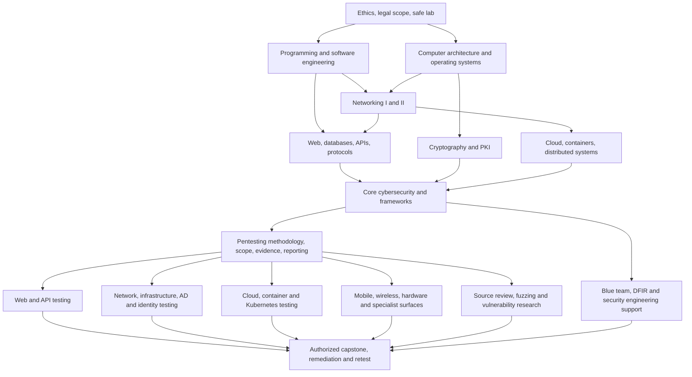

# Pentesting and Ethical Hacking Learning Roadmap

An English, foundation-first curriculum whose primary outcome is professional **penetration testing and ethical hacking**. It develops the computer-science, networking, operating-system, software, cloud, and defensive knowledge required to assess systems safely, explain root causes, communicate business risk, and verify remediation. Official standards, university material, widely adopted open-source repositories, legal labs, and portfolio projects are used throughout.

> **Last reviewed:** 2026-09-11  
> **Primary focus:** authorized network, infrastructure, Active Directory, web, API, mobile, cloud, container, wireless, and hardware penetration testing; ethical hacking; vulnerability validation; reporting; remediation; and retesting.  
> **Supporting scope:** defensive security, security engineering, red/purple teaming, blue team/SOC, DFIR, malware analysis, threat intelligence, GRC, IAM, OT/ICS, AI security, and vulnerability research.

> [!IMPORTANT]
> Use offensive techniques only in a lab, CTF, bug-bounty program, or system for which you have explicit written authorization. Define scope, time window, allowed techniques, data-handling rules, emergency contacts, and stop conditions before testing. Never test a public target merely because a tool can reach it.

## Table of Contents

- [How to Use This Roadmap](#how-to-use-this-roadmap)
- [Curriculum Map](#curriculum-map)
- [Part I — Mandatory Foundations](#part-i--mandatory-foundations)
  - [0. Ethics, Law, Safety, and Lab Setup](#0-ethics-law-safety-and-lab-setup)
  - [1. Mathematics, Logic, and Technical Communication](#1-mathematics-logic-and-technical-communication)
  - [2. Programming, Scripting, and Software Engineering](#2-programming-scripting-and-software-engineering)
  - [3. Computer Architecture and Low-Level Computing](#3-computer-architecture-and-low-level-computing)
  - [4. Operating Systems and System Administration](#4-operating-systems-and-system-administration)
  - [5. Computer Networking I — Foundations](#5-computer-networking-i--foundations)
  - [6. Computer Networking II — Advanced](#6-computer-networking-ii--advanced)
  - [7. Web, Databases, APIs, and Internet Protocols](#7-web-databases-apis-and-internet-protocols)
  - [8. Cryptography and PKI](#8-cryptography-and-pki)
  - [9. Virtualization, Containers, Cloud, and Distributed Systems](#9-virtualization-containers-cloud-and-distributed-systems)
  - [10. Foundation Exit Gate](#10-foundation-exit-gate)
- [Part II — Core Cybersecurity](#part-ii--core-cybersecurity)
- [Part III — Pentesting and Ethical Hacking Primary Path](#part-iii--pentesting-and-ethical-hacking-primary-path)
- [Part IV — Hands-On Lab and Portfolio Plan](#part-iv--hands-on-lab-and-portfolio-plan)
  - [Lab Setup and Checklist Index](#lab-setup-and-checklist-index)
  - [Safe Lab Architecture](#safe-lab-architecture)
  - [Progressive Lab Ladder](#progressive-lab-ladder)
- [Part V — Tools by Purpose](#part-v--tools-by-purpose)
- [Part VI — Curated Resource Library](#part-vi--curated-resource-library)
- [Optional Certifications](#optional-certifications)
- [Maintenance Rules](#maintenance-rules)

## How to Use This Roadmap

Pentesting is applied computer science conducted under explicit authorization. Do not begin by memorizing attack commands. First learn how normal systems, networks, applications, identity, and operations work; then learn how they fail, how to validate impact safely, and how to help owners fix the root cause.

### Pentesting-first route

1. Complete [Part I](#part-i--mandatory-foundations) and pass the [Foundation Exit Gate](#10-foundation-exit-gate); test out only by producing the required evidence.
2. Complete [Part II](#part-ii--core-cybersecurity) to learn risk, controls, architecture, telemetry, response, and assessment methodology.
3. Treat the [Authorized Penetration Testing and Ethical Hacking track](#primary-track--authorized-penetration-testing-and-ethical-hacking) as the mandatory professional path, not an optional specialization.
4. Complete two pentest capstones on different attack surfaces, including written scope, manual validation, remediation, cleanup, and retest.
5. Add one supporting specialization only after the primary pentest exit gate. Blue team, DFIR, malware analysis, GRC, and red teaming support better assessments but do not replace the primary path.

### Resource labels

- **Official** — a standards body, project owner, vendor, or government source.
- **University** — open course or teaching material from an academic institution.
- **Repository** — source code or community-maintained reference on GitHub.
- **Lab** — a legal practice environment. Some platforms have optional paid content.

### Recommended study loop

For every module:

1. **Learn:** understand concepts and vocabulary.
2. **Build:** configure or implement the normal system.
3. **Observe:** capture traffic, logs, system calls, or application behavior.
4. **Break safely:** reproduce a failure only in an authorized lab.
5. **Defend:** harden, detect, respond, and validate remediation.
6. **Document:** publish a sanitized diagram, code, test evidence, and concise report.

Use roughly 40% theory, 50% hands-on work, and 10% writing/review. Move forward based on exit criteria, not elapsed time. A beginner studying 10–15 hours per week will commonly need 9–18 months for the foundations, core security, and an entry-level pentesting path; mastery remains continuous.

## Curriculum Map



| Stage | Required result | Suggested evidence |
|---|---|---|
| Foundations | Explain and operate computers, networks, OSs, web apps, APIs, crypto, and cloud basics | Code, diagrams, packet captures, admin runbooks |
| Core security | Model risk, apply controls, investigate events, and assess vulnerabilities | Threat model, hardened baseline, incident report, assessment report |
| Primary pentest path | Plan and execute an authorized assessment end to end using repeatable methodology | Two substantial pentest capstones on different attack surfaces |
| Supporting specialization | Add deeper AppSec, cloud, mobile, red-team, defensive, DFIR, malware, or research capability | One role-specific capstone |
| Professional practice | Communicate scope, evidence, risk, remediation, and residual risk | Sanitized portfolio and executive/technical reports |

# Part I — Mandatory Foundations

Complete these modules before specializing. Experienced learners may test out by producing the exit-gate evidence.

## 0. Ethics, Law, Safety, and Lab Setup

### Learn

- Authorization, ownership, acceptable-use policies, contracts, rules of engagement, privacy, evidence handling, and responsible disclosure.
- The difference between vulnerability research, a penetration test, a red-team engagement, bug bounty, CTF, and unauthorized access.
- Scope boundaries: hosts, accounts, cloud tenants, APIs, third parties, social engineering, denial of service, persistence, destructive tests, and data exfiltration.
- Operational safety: snapshots, backups, kill switches, isolated networks, resource/cost limits, secret rotation, and safe cleanup.
- Research ethics and coordinated vulnerability disclosure. Laws vary by jurisdiction; obtain qualified legal advice when necessary.

### Build the lab

- A host with current patches, full-disk encryption, password manager, MFA, and reliable backups.
- A hypervisor such as [VirtualBox](https://www.virtualbox.org/) or [VMware Workstation](https://www.vmware.com/products/desktop-hypervisor/workstation-and-fusion).
- Separate **management**, **attacker**, **target**, and optional **monitoring** networks. Keep vulnerable machines off bridged networking.
- Linux and Windows evaluation VMs; snapshots before each exercise; no personal data in targets.
- Git repositories for notes/code, with `.gitignore`, a license, and secret scanning. Never commit tokens, private keys, malware, customer data, or unredacted findings.
- For malware analysis, use a dedicated non-production host if possible, non-routable networking, snapshots, and disabled shared clipboard/folders. Begin with benign samples such as the [EICAR anti-malware test file](https://www.eicar.org/download-anti-malware-testfile/).

### Lab setup guides and safety checklist

- **Virtualization and networking:** [VirtualBox networking manual](https://www.virtualbox.org/manual/ch06.html), [libvirt virtual networking](https://wiki.libvirt.org/VirtualNetworking.html), and [GNS3 installation guide](https://docs.gns3.com/docs/getting-started/installation/windows/).
- **Reproducible teaching environment:** [SEED Labs](https://seedsecuritylabs.org/) and its [official lab-setup repository guide](https://github.com/seed-labs/seed-labs/blob/master/lab-setup/README.md).
- **Before powering on a vulnerable target:** verify host-only/internal attachment, deny unintended bridging, take a clean snapshot, use synthetic accounts/data, synchronize time, restrict egress, define resource/cost limits, and test the emergency stop.
- **Before finishing:** export only sanitized evidence, remove temporary accounts/keys, verify no persistence or exposed services remain, revert or destroy the target, and record the teardown result in `LAB_RULES.md`.

### Primary references

- **Official:** [DOJ Framework for a Vulnerability Disclosure Program](https://www.justice.gov/criminal/criminal-ccips/page/file/983996/dl)
- **Official:** [CISA Vulnerability Disclosure Policy Platform](https://www.cisa.gov/resources-tools/services/vulnerability-disclosure-policy-vdp-platform)
- **Official:** [FIRST Multi-Party Vulnerability Coordination](https://www.first.org/global/sigs/vulnerability-coordination/multiparty/)
- **Official:** [HackerOne Disclosure Guidelines](https://www.hackerone.com/disclosure-guidelines)

### Deliverable

Write `LAB_RULES.md` containing the network diagram, assets, permitted and forbidden actions, snapshots/backups, data policy, emergency stop procedure, and teardown checklist. Start from the [Universal lab run sheet](#universal-lab-run-sheet) and align assessment safety with [NIST SP 800-115](https://csrc.nist.gov/pubs/sp/800/115/final).

## 1. Mathematics, Logic, and Technical Communication

Security practitioners need enough mathematics to reason precisely and enough writing skill to make findings actionable.

### Learn

- Binary, hexadecimal, bitwise operations, signed/unsigned integers, overflow, endianness, encoding, and units.
- Sets, relations, functions, Boolean/propositional logic, truth tables, predicates, proof intuition, and invariants.
- Discrete probability, conditional probability, Bayes' rule, entropy intuition, distributions, expected value, false-positive/false-negative rates, and base-rate effects.
- Modular arithmetic, greatest common divisor, primes, finite fields at an introductory level, and why these matter in cryptography.
- Graphs, trees, state machines, shortest paths, complexity, and Big-O notation.
- Technical writing: audience, assumptions, reproducible steps, timestamps/time zones, evidence, severity versus business impact, remediation, and executive summaries.

### Resources

- **University:** [MIT Mathematics for Computer Science](https://ocw.mit.edu/courses/6-042j-mathematics-for-computer-science-spring-2015/)
- **University/Repository:** [OSSU Mathematics](https://github.com/ossu/math)
- **Official:** [NIST SP 800-30 Rev. 1 — Risk Assessments](https://csrc.nist.gov/pubs/sp/800/30/r1/final)
- **Official:** [Google Technical Writing Courses](https://developers.google.com/tech-writing)

### Deliverable

Use [MIT Mathematics for Computer Science](https://ocw.mit.edu/courses/6-042j-mathematics-for-computer-science-spring-2015/) for the reasoning exercise and [Google Technical Writing](https://developers.google.com/tech-writing) for review. Explain a security alert using a truth table and base-rate example, convert a packet field between binary/hexadecimal/decimal, and write a one-page finding for both engineers and executives.

## 2. Programming, Scripting, and Software Engineering

Do not attempt to master every language at once. Learn **Python + Bash/PowerShell + Git first**, then **C + assembly fundamentals**. Add JavaScript/TypeScript and SQL for application security. Choose Java, .NET, Go, or Rust according to the systems you intend to secure.

### Common engineering knowledge

- Variables, types, control flow, functions, modules, exceptions, files, serialization, regular expressions, and package management.
- Data structures and algorithms: arrays, linked structures, stacks, queues, hash tables, trees, graphs, searching, sorting, and complexity.
- Processes, threads, concurrency, asynchronous I/O, sockets, IPC, and client/server design.
- Testing: unit, integration, property/fuzz testing, fixtures, coverage, debugging, profiling, and reproducible builds.
- Git: commits, branches, merges/rebases, tags, pull requests, code review, signed releases, and secret hygiene.
- Build systems, dependencies, semantic versioning, CI/CD, artifact registries, SBOMs, and software-supply-chain risk.
- Secure coding: input validation, output encoding, memory/resource ownership, error handling, logging without secrets, least privilege, dependency pinning, safe deserialization, and correct use of cryptographic libraries.

### Language priorities

| Language | Why security practitioners use it | Minimum project |
|---|---|---|
| Python | Automation, APIs, packet/log parsing, tooling, data analysis | Parse JSON/CSV logs, enrich indicators, produce tests and a report |
| Bash | Linux automation and pipelines | Inventory a Linux host and emit machine-readable output |
| PowerShell | Windows/AD administration and detection | Query event logs and produce a signed, read-only triage report |
| C/C++ | Memory, ABI, systems calls, parsers, vulnerabilities | Implement and debug a small binary protocol parser safely |
| x86-64/ARM assembly | Calling conventions, stack/heap, reverse engineering | Trace a compiled function and annotate registers/stack frames |
| JavaScript/TypeScript | Browsers, Node.js, frontend/backend and web attacks | Build a small authenticated web UI and REST API |
| SQL | Data modeling, queries, permissions, injection prevention | Design a schema and compare parameterized versus unsafe queries in a lab |
| Java/.NET | Enterprise applications and Android/Windows ecosystems | Build a service with tests, structured logs, and authorization |
| Go | Networking, cloud-native security tools, static binaries | Build a concurrent network-service health checker for lab assets |
| Rust | Memory-safe systems programming and tooling | Reimplement the parser with explicit error handling and fuzz tests |

### Primary resources

- **Official:** [Python Tutorial](https://docs.python.org/3/tutorial/), [Go Tour](https://go.dev/tour/), [The Rust Book](https://doc.rust-lang.org/book/), [Rustonomicon](https://doc.rust-lang.org/nomicon/)
- **Official:** [GNU Bash Manual](https://www.gnu.org/software/bash/manual/), [PowerShell Documentation](https://learn.microsoft.com/powershell/), [MDN JavaScript Guide](https://developer.mozilla.org/docs/Web/JavaScript/Guide)
- **Official:** [Dev.java Learn](https://dev.java/learn/), [.NET Documentation](https://learn.microsoft.com/dotnet/), [PostgreSQL Tutorial](https://www.postgresql.org/docs/current/tutorial.html)
- **Official:** [Git Reference](https://git-scm.com/docs), [Pro Git](https://git-scm.com/book/en/v2)
- **Official:** [SEI CERT C and C++ Coding Standards](https://www.sei.cmu.edu/library/sei-cert-c-and-c-coding-standards/), [OWASP Secure Coding Practices](https://owasp.org/www-project-secure-coding-practices-quick-reference-guide/)
- **University:** [Harvard CS50x](https://cs50.harvard.edu/x/), [MIT Missing Semester](https://missing.csail.mit.edu/)
- **Full CS curriculum:** [OSSU Computer Science](https://github.com/ossu/computer-science) — use its programming, algorithms, architecture, operating-systems, networking, and security courses selectively alongside this pentesting roadmap.
- **Repository:** [TheAlgorithms/Python](https://github.com/TheAlgorithms/Python), [30 Days of Python](https://github.com/Asabeneh/30-Days-Of-Python), [Project Based Learning](https://github.com/practical-tutorials/project-based-learning)
- **Tools:** [ShellCheck](https://github.com/koalaman/shellcheck), [Ruff](https://github.com/astral-sh/ruff), [Semgrep](https://github.com/semgrep/semgrep), [CodeQL](https://github.com/github/codeql)

### Per-language courses, repositories, and security labs

Use this table as a minimum resource map, not as a requirement to finish every item. A good order is Python → Bash/PowerShell → C → assembly → JavaScript/TypeScript + SQL; then add Java/.NET, Go, or Rust for the systems you assess.

| Language | Core course and documentation | Repository or guided practice | Security-oriented evidence |
|---|---|---|---|
| Python | [CS50P](https://cs50.harvard.edu/python/) and the [Python Tutorial](https://docs.python.org/3/tutorial/) | [Exercism Python track](https://exercism.org/tracks/python), [TheAlgorithms/Python](https://github.com/TheAlgorithms/Python), and [pytest](https://github.com/pytest-dev/pytest) | Build a typed, tested log/API/packet automation tool with bounded input and no embedded secrets |
| Bash | [GNU Bash Manual](https://www.gnu.org/software/bash/manual/) and [Missing Semester: shell](https://missing.csail.mit.edu/2020/course-shell/) | [Bats-core](https://github.com/bats-core/bats-core) and [ShellCheck](https://github.com/koalaman/shellcheck) | Produce a read-only host inventory script with strict error handling, tests, and machine-readable output |
| PowerShell | [Microsoft Learn: Introduction to PowerShell](https://learn.microsoft.com/training/modules/introduction-to-powershell/) and [PowerShell documentation](https://learn.microsoft.com/powershell/) | [PowerShell](https://github.com/PowerShell/PowerShell) and [Pester](https://github.com/pester/Pester) | Query Windows event/configuration data with least privilege; test and sign the triage script |
| C/C++ | [CS50x](https://cs50.harvard.edu/x/), [SEI CERT C/C++](https://www.sei.cmu.edu/library/sei-cert-c-and-c-coding-standards/), and [cppreference](https://en.cppreference.com/) | [Google Sanitizers](https://github.com/google/sanitizers), [CS:APP labs](https://csapp.cs.cmu.edu/3e/labs.html), and [SEED software-security labs](https://seedsecuritylabs.org/) | Implement and fuzz a bounded parser; explain each compiler mitigation and sanitizer finding |
| x86-64 assembly | [Intel manuals](https://www.intel.com/content/www/us/en/developer/articles/technical/intel-sdm.html), [NASM documentation](https://www.nasm.us/docs.php), and [System V AMD64 ABI](https://gitlab.com/x86-psABIs/x86-64-ABI) | [pwn.college Assembly Crash Course](https://pwn.college/cse365-f2023/assembly-crash-course), [OpenSecurityTraining2](https://p.ost2.fyi/), [0xAX/asm](https://github.com/0xAX/asm), [NASM source](https://github.com/netwide-assembler/nasm), and [tmcuong-tech/assembly](https://github.com/tmcuong-tech/assembly) | Compile C to assembly, annotate registers/flags/stack/calling convention, and debug a benign binary |
| ARM64 and RISC-V assembly | [Arm developer documentation](https://developer.arm.com/documentation), [RISC-V specifications](https://riscv.org/technical/specifications/), and [RISC-V Assembly Programmer's Manual](https://github.com/riscv-non-isa/riscv-asm-manual) | [Compiler Explorer](https://godbolt.org/), [Nand2Tetris projects](https://www.nand2tetris.org/), and [RE for Beginners](https://github.com/Cactus-proj/RE-for-Beginners) | Compare the same function across x86-64/ARM64/RISC-V and identify ABI, endian, branch, and memory-access differences |
| JavaScript/TypeScript | [MDN JavaScript Guide](https://developer.mozilla.org/docs/Web/JavaScript/Guide), [TypeScript Handbook](https://www.typescriptlang.org/docs/handbook/intro.html), and [Full Stack Open](https://fullstackopen.com/en/) | [NodeGoat](https://github.com/OWASP/NodeGoat), [Juice Shop](https://github.com/juice-shop/juice-shop), and [Web Security Academy](https://portswigger.net/web-security) | Build and test browser/Node trust boundaries, authorization, safe DOM handling, and dependency controls |
| SQL | [PostgreSQL Tutorial](https://www.postgresql.org/docs/current/tutorial.html) and [SQLBolt](https://sqlbolt.com/) | [PortSwigger SQL injection labs](https://portswigger.net/web-security/sql-injection), [DVWA](https://github.com/digininja/DVWA), and [NodeGoat](https://github.com/OWASP/NodeGoat) | Model roles and transactions; prove parameterized queries prevent the corresponding injection case |
| Java and .NET | [Dev.java Learn](https://dev.java/learn/), [.NET learning center](https://dotnet.microsoft.com/learn), and [ASP.NET Core Web API tutorial](https://learn.microsoft.com/aspnet/core/tutorials/first-web-api) | [WebGoat](https://github.com/WebGoat/WebGoat), [OWASP BenchmarkJava](https://github.com/OWASP-Benchmark/BenchmarkJava), and [ASP.NET Core samples](https://github.com/dotnet/aspnetcore/tree/main/src/Security/samples) | Build an enterprise-style service with authentication, object-level authorization, audit logs, SAST, and tests |
| Go | [A Tour of Go](https://go.dev/tour/) and [Effective Go](https://go.dev/doc/effective_go) | [Exercism Go track](https://exercism.org/tracks/go) and [Go fuzzing tutorial](https://go.dev/doc/tutorial/fuzz) | Build a concurrent lab-service checker with deadlines, TLS verification, fuzz tests, and explicit error handling |
| Rust | [The Rust Book](https://doc.rust-lang.org/book/) and [Rustonomicon](https://doc.rust-lang.org/nomicon/) | [Rustlings](https://github.com/rust-lang/rustlings) and [Exercism Rust track](https://exercism.org/tracks/rust) | Rebuild the C parser, document unsafe boundaries, and demonstrate memory-safe failures under malformed input |

### Exit criteria

- Use the [per-language resource table](#per-language-courses-repositories-and-security-labs) and [GitHub secure-use guidance](https://docs.github.com/en/code-security/getting-started) to select the course, practice repository, tests, and CI controls for each project.
- Read unfamiliar code, use a debugger, explain data flow, add tests, and fix a defect.
- Build a TCP client/server and an HTTP API without copying a complete tutorial.
- Safely parse untrusted input with bounds, type, size, timeout, and error checks.
- Use Git branches and pull requests; run lint, tests, dependency scanning, and secret scanning in CI.

## 3. Computer Architecture and Low-Level Computing

### Learn

- Boolean logic, combinational/sequential circuits, registers, clocks, memory hierarchy, caches, buses, interrupts, DMA, and I/O.
- ISA versus microarchitecture; x86-64, ARM64, and RISC-V overview; registers, instructions, flags, stack, calling conventions, syscalls, and ABI.
- Compilation pipeline: preprocessor, compiler, assembler, linker, loader, symbols, relocation, ELF, PE, Mach-O, shared libraries, and dynamic linking.
- Virtual memory, paging, page tables, TLB, privilege rings, user/kernel mode, exceptions, context switches, and hardware virtualization.
- Stack versus heap, object layout, alignment, integer representation, memory corruption, use-after-free, and race conditions.
- Security mechanisms: NX/DEP, ASLR, stack canaries, RELRO, PIE, CFI, CET, PAC, sandboxing, TPM, secure boot, enclaves, and speculative-execution risk.

### Resources

- **Course:** [Nand2Tetris](https://www.nand2tetris.org/)
- **University:** [UC Berkeley CS61C](https://cs61c.org/), [MIT 6.S081/xv6](https://pdos.csail.mit.edu/6.S081/)
- **Repository/course:** [MIT xv6 RISC-V](https://github.com/mit-pdos/xv6-riscv), [OpenSecurityTraining2](https://opensecuritytraining.info/), [RPISEC Modern Binary Exploitation](https://github.com/RPISEC/MBE)
- **Official:** [Intel Software Developer Manuals](https://www.intel.com/content/www/us/en/developer/articles/technical/intel-sdm.html), [AMD64 Architecture Programmer's Manual](https://docs.amd.com/v/u/en-US/40332_4.09_APM_PUB), [Arm Developer Documentation](https://developer.arm.com/documentation)
- **Official:** [System V AMD64 ABI](https://gitlab.com/x86-psABIs/x86-64-ABI), [ELF Specification](https://refspecs.linuxfoundation.org/elf/elf.pdf), [Microsoft PE Format](https://learn.microsoft.com/windows/win32/debug/pe-format)

### Labs and exit criteria

- Work through the relevant [CS:APP self-study labs](https://csapp.cs.cmu.edu/3e/labs.html), [pwn.college Assembly Crash Course](https://pwn.college/cse365-f2023/assembly-crash-course), [Nand2Tetris projects](https://www.nand2tetris.org/), or [xv6 labs](https://pdos.csail.mit.edu/6.S081/). Use [RPISEC MBE](https://github.com/RPISEC/MBE) only inside the authorized lab.
- Compile a C program with different optimization/hardening flags; use [Compiler Explorer](https://godbolt.org/) and local tools to inspect symbols, sections, imports, disassembly, and runtime behavior.
- Trace a syscall with `strace` or equivalent, debug a crash with GDB/WinDbg, and map source to assembly. Record compiler, architecture, ABI, mitigations, commands, and expected output.
- Explain a virtual-to-physical memory translation and why ASLR/NX raise exploitation cost without eliminating all bugs.

## 4. Operating Systems and System Administration

### Shared OS concepts

- Boot flow, kernel, drivers, processes/threads, scheduling, virtual memory, filesystems, storage, devices, IPC, sockets, services, and logging.
- Users, groups, credentials, sessions, authentication, authorization, ACLs, capabilities/privileges, tokens, and least privilege.
- Packages, updates, configuration management, backups/restores, time synchronization, monitoring, remote management, and hardening.
- Mandatory/discretionary access control, sandboxing, virtualization, containers, endpoint protection, and audit trails.

### Linux — required depth

- Filesystem hierarchy, inodes, links, mounts, permissions, `umask`, POSIX ACLs, capabilities, namespaces, cgroups, `/proc`, `/sys`, and devices.
- Boot process, UEFI, GRUB, initramfs, kernel modules, `systemd`, units, targets, timers, journals, and service troubleshooting.
- Process/job control, signals, pipes, redirection, environment, cron/timers, package repositories, compilation, and shared libraries.
- Network configuration, routes, resolver behavior, sockets, SSH, nftables, SELinux/AppArmor, auditd, and centralized logging.
- Secure administration: patching, minimal packages, non-root operation, SSH keys, sudo policy, service isolation, backups, secrets, and CIS-aligned baselines.

**Resources:** [Linux kernel documentation](https://docs.kernel.org/), [Linux Foundation — Introduction to Linux](https://training.linuxfoundation.org/training/introduction-to-linux/), [ArchWiki](https://wiki.archlinux.org/), [man-pages](https://man7.org/linux/man-pages/), [systemd manuals](https://www.freedesktop.org/software/systemd/man/latest/), [nftables wiki](https://wiki.nftables.org/), [SELinux Project](https://github.com/SELinuxProject), [Ansible Lockdown](https://github.com/ansible-lockdown)

### Windows and Active Directory — required depth

- Windows boot, registry, services, processes/threads, object manager, access tokens, SIDs, privileges, integrity levels, UAC, ACLs, NTFS, and PowerShell.
- Event logs, ETW concepts, Sysmon, Defender, AMSI, AppLocker/WDAC, Windows Firewall, BitLocker, Credential Guard, LSA, DPAPI, and security baselines.
- AD DS: forests, domains, trusts, organizational units, schema, users/groups/computers, Group Policy, LDAP, Kerberos, NTLM, DNS integration, certificates/AD CS, replication, and tiered administration.
- Administration: patching, backup/restore, remote management, service accounts/gMSA, local admin password management, auditing, and least privilege.

**Resources:** [Windows documentation](https://learn.microsoft.com/windows/), [Windows security](https://learn.microsoft.com/windows/security/), [AD DS overview](https://learn.microsoft.com/windows-server/identity/ad-ds/get-started/virtual-dc/active-directory-domain-services-overview), [Sysinternals](https://learn.microsoft.com/sysinternals/), [PowerShell](https://learn.microsoft.com/powershell/), [Microsoft Security Baselines](https://learn.microsoft.com/windows/security/operating-system-security/device-management/windows-security-configuration-framework/windows-security-baselines)

### macOS — working knowledge

- Darwin/XNU, APFS, launchd, Keychain, code signing, notarization, entitlements, sandbox, Gatekeeper, FileVault, System Integrity Protection, Transparency Consent and Control, Endpoint Security, unified logs, and MDM.

**Resources:** [Apple Platform Security](https://support.apple.com/guide/security/welcome/web), [Apple Deployment](https://support.apple.com/guide/deployment/welcome/web), [Apple Developer Security](https://developer.apple.com/security/), [XNU source](https://github.com/apple-oss-distributions/xnu)

### Guided administration labs

- **Linux:** use the [Linux Upskill Challenge](https://github.com/livialima/linuxupskillchallenge), [Linux Journey](https://linuxjourney.com/), and [OSTEP homework](https://github.com/remzi-arpacidusseau/ostep-homework) to practice users, services, storage, networking, permissions, processes, logs, and troubleshooting.
- **Windows and Active Directory:** follow [Microsoft's AD DS learning path](https://learn.microsoft.com/training/paths/active-directory-domain-services/) and the [AZ-1008 lab repository](https://github.com/MicrosoftLearning/AZ-1008-Administer-Active-Directory-Domain-Services) before attempting the isolated [GOAD](https://github.com/Orange-Cyberdefense/GOAD) security range.
- **Hardening and verification:** compare settings with [CIS Benchmarks](https://www.cisecurity.org/cis-benchmarks), [Microsoft Security Baselines](https://learn.microsoft.com/windows/security/operating-system-security/device-management/windows-security-configuration-framework/windows-security-baselines), and [ComplianceAsCode](https://github.com/ComplianceAsCode/content). Keep a before/after export and a rollback test.

### Deliverables

- Harden one Linux and one Windows VM, document every change/rollback, and compare them with an applicable [CIS Benchmark](https://www.cisecurity.org/cis-benchmarks).
- Create users/groups, least-privilege services, host firewalls, remote administration, backups, patching, time sync, and centralized logs.
- Diagnose failed boot/service/DNS/network/permission scenarios using evidence rather than rebooting blindly.

## 5. Computer Networking I — Foundations

### Learn in this order

1. **Models and media:** OSI and TCP/IP models, encapsulation, Ethernet, Wi-Fi, frames, packets, segments/datagrams, MTU, bandwidth, latency, jitter, and loss.
2. **Layer 2:** MAC addresses, unicast/broadcast/multicast, ARP, switches, CAM tables, collision/broadcast domains, VLANs, access/trunk ports, and 802.1Q.
3. **Layer 3:** IPv4, CIDR, subnetting/VLSM, public/private/link-local/loopback addresses, routing tables, default gateways, TTL, ICMP, fragmentation, and NAT/PAT.
4. **IPv6:** notation, prefixing, global/link-local/unique-local addresses, NDP, SLAAC, DHCPv6, ICMPv6, dual stack, and transition basics.
5. **Layer 4:** TCP handshake/teardown, sequence and acknowledgment numbers, windows, retransmission, congestion/flow control, ports, states, and UDP tradeoffs.
6. **Core services:** DHCP, DNS, ARP/NDP, NTP, SSH, SMTP/IMAP, SNMP, syslog, FTP/SFTP, and SMB basics.
7. **Application path:** URL parsing → DNS → routing/ARP → TCP or QUIC → TLS → HTTP → reverse proxy/load balancer → application/database → response/cache.
8. **Troubleshooting:** define the failure, identify layer/scope, form a hypothesis, capture evidence, change one variable, validate, and document.

### Essential commands and tools

`ip`, `ss`, `ping`, `traceroute`/`tracert`, `mtr`, `arp`/`ip neigh`, `dig`/`nslookup`, `curl`, `openssl s_client`, `nc`, `tcpdump`, [Wireshark](https://www.wireshark.org/), [Nmap](https://nmap.org/), [iperf3](https://github.com/esnet/iperf), and router/firewall logs.

### Authoritative references

- **Official:** [Cisco Skills for All — Networking](https://skillsforall.com/), [Juniper Open Learning](https://learningportal.juniper.net/juniper/user_activity_info.aspx?id=JUNIPER-OPEN-LEARNING)
- **Open book:** [Computer Networks: A Systems Approach](https://github.com/SystemsApproach/book)
- **University:** [Stanford CS144 — Introduction to Computer Networking](https://bulletin.stanford.edu/courses/2075241)
- **RFCs:** [ARP — RFC 826](https://www.rfc-editor.org/rfc/rfc826), [IPv4 — RFC 791](https://www.rfc-editor.org/rfc/rfc791), [IPv6 — RFC 8200](https://www.rfc-editor.org/rfc/rfc8200), [TCP — RFC 9293](https://www.rfc-editor.org/rfc/rfc9293), [UDP — RFC 768](https://www.rfc-editor.org/rfc/rfc768), [ICMPv4 — RFC 792](https://www.rfc-editor.org/rfc/rfc792), [IPv6 NDP — RFC 4861](https://www.rfc-editor.org/rfc/rfc4861), [DHCP — RFC 2131](https://www.rfc-editor.org/rfc/rfc2131)
- **DNS:** [RFC 1034](https://www.rfc-editor.org/rfc/rfc1034), [RFC 1035](https://www.rfc-editor.org/rfc/rfc1035), and [Cloudflare Learning Center](https://www.cloudflare.com/learning/)
- **Labs:** [Cisco Packet Tracer](https://www.netacad.com/courses/packet-tracer), [GNS3](https://www.gns3.com/), [containerlab](https://containerlab.dev/)

### Labs and exit criteria

- Start with [Cisco Packet Tracer](https://www.netacad.com/courses/packet-tracer); move to the [GNS3 installation guide](https://docs.gns3.com/docs/getting-started/installation/windows/) or [containerlab quickstart](https://containerlab.dev/quickstart/) when you need reproducible multi-node topologies. Use [Wireshark sample captures](https://wiki.wireshark.org/SampleCaptures) before capturing your own traffic.
- Subnet IPv4 and IPv6 networks by hand and verify the result with tools.
- Build two VLANs and route between them; demonstrate what broadcasts cross each boundary.
- Capture and annotate DHCP, ARP/NDP, DNS, TCP handshake, TLS handshake, and HTTP traffic.
- Given a broken client-to-service path, locate the failing layer and prove the root cause.
- Draw the complete path of a browser request, including state held by switches, routers, NAT, firewall, resolver, proxy, and server.

## 6. Computer Networking II — Advanced

This module goes beyond recognizing protocols. The goal is to understand how forwarding decisions are made, how reachability is advertised, how policy allows or denies traffic, and how to verify the actual path.

### 6.1 Forwarding internals

- Control plane versus data plane; routing information base (RIB) versus forwarding information base (FIB).
- Longest-prefix match, administrative distance/preference, metrics, recursive next-hop resolution, equal-cost multipath, policy-based routing, and asymmetric paths.
- TTL/hop limit, checksums, MTU, MSS, fragmentation, Path MTU Discovery, ICMP errors, and black-hole diagnosis.
- ARP/NDP cache behavior, neighbor states, proxy ARP, gratuitous ARP, and first-hop redundancy.

### 6.2 Switching and campus networks

- VLAN design, 802.1Q trunks, native VLAN risks, inter-VLAN routing, QinQ concepts, and private VLANs.
- STP/RSTP/MSTP: root election, port roles/states, topology change, loop prevention, BPDU Guard, Root Guard, and troubleshooting.
- Link aggregation/LACP, MLAG concepts, port security, DHCP snooping, Dynamic ARP Inspection, IP Source Guard, and 802.1X/NAC.

### 6.3 Dynamic routing and Shortest Path First

- Distance-vector, link-state, and path-vector approaches; convergence, failure domains, summarization, redistribution, route filtering, and route leaks.
- **OSPF:** Dijkstra's Shortest Path First (SPF), neighbors/adjacencies, hello/dead timers, link-state advertisements, link-state database, areas, backbone, ABR/ASBR, DR/BDR, network types, costs, authentication, OSPFv2 versus OSPFv3, and failure troubleshooting.
- **IS-IS:** levels, areas, LSPs, TLVs, DIS, metrics, and why service-provider networks often use it.
- **BGP:** eBGP/iBGP, path attributes, best-path selection, local preference, MED, communities, route reflectors, policy, aggregation, multihoming, graceful restart, prefix limits, filtering, and route-leak/hijack risk.
- Routing security: RPKI/ROV, MANRS principles, bogon filtering, uRPF, control-plane policing, management-plane isolation, and authenticated routing sessions.

**Standards:** [OSPFv2 — RFC 2328](https://www.rfc-editor.org/rfc/rfc2328), [OSPFv3 — RFC 5340](https://www.rfc-editor.org/rfc/rfc5340), [IS-IS for IP — RFC 1195](https://www.rfc-editor.org/rfc/rfc1195), [BGP-4 — RFC 4271](https://www.rfc-editor.org/rfc/rfc4271), [RPKI Route Origin Validation — RFC 6811](https://www.rfc-editor.org/rfc/rfc6811), [MANRS](https://www.manrs.org/)

### 6.4 Network services at depth

- DNS recursion/iteration, root/TLD/authoritative servers, delegation, zones, record types, negative caching, split-horizon DNS, dynamic updates, zone transfers, DNSSEC chain of trust, DoT, and DoH.
- DHCP scopes, options, reservations, relay, failover, rogue-server risk, and IPv6 address assignment.
- NTP hierarchy/authentication, SNMPv3, syslog, IPFIX/NetFlow, telemetry, AAA with RADIUS/TACACS+, LDAP, and Kerberos dependencies.
- **Email SPF is different from OSPF:** learn Sender Policy Framework, DKIM signing, DMARC policy/alignment/reporting, SMTP transport, MTA-STS, and TLS reporting.

**Standards:** [DNSSEC — RFC 4033](https://www.rfc-editor.org/rfc/rfc4033), [DNS over TLS — RFC 7858](https://www.rfc-editor.org/rfc/rfc7858), [DNS over HTTPS — RFC 8484](https://www.rfc-editor.org/rfc/rfc8484), [Email SPF — RFC 7208](https://www.rfc-editor.org/rfc/rfc7208), [DKIM — RFC 6376](https://www.rfc-editor.org/rfc/rfc6376), [DMARC — RFC 7489](https://www.rfc-editor.org/rfc/rfc7489)

### 6.5 Firewalls, ACLs, segmentation, and policy

- Stateless ACL versus stateful firewall; five-tuple, connection tracking, zones, objects/groups, rule order, implicit/default deny, ingress versus egress, and return traffic.
- Allowlist versus blocklist, least privilege, anti-spoofing, management access, logging, rate limits, timeouts, and safe rule-change workflow.
- Network segmentation, microsegmentation, DMZs, VRFs, jump hosts, bastions, proxies, secure web gateways, IDS/IPS placement, and zero-trust principles.
- NAT44, PAT, static/dynamic NAT, NAT64/DNS64, hairpinning, port forwarding, and why NAT is not a security policy by itself.
- Linux nftables, Windows Defender Firewall, BSD/macOS `pf`, cloud security groups/NACLs, Kubernetes NetworkPolicy, and service-mesh policy.

### 6.6 VPNs, overlays, data centers, and WAN

- IPsec architecture, IKEv2, transport/tunnel modes, security associations, GRE, WireGuard, TLS VPN concepts, and remote-access versus site-to-site design.
- MPLS labels/L3VPN concepts, VXLAN/EVPN, underlay versus overlay, leaf-spine, east-west versus north-south traffic, anycast, and load balancing.
- SD-WAN/SDN concepts, controllers, APIs, intent/policy, failure modes, and control-plane protection.
- QoS classification/marking, DSCP, queuing, shaping, policing, congestion avoidance, and when packet priority affects security tooling.
- High availability: LACP, ECMP, VRRP/HSRP concepts, BFD, redundant DNS/DHCP/firewalls, health checks, and failure testing.

**Standards/resources:** [IPsec Architecture — RFC 4301](https://www.rfc-editor.org/rfc/rfc4301), [IKEv2 — RFC 7296](https://www.rfc-editor.org/rfc/rfc7296), [WireGuard](https://www.wireguard.com/), [VXLAN — RFC 7348](https://www.rfc-editor.org/rfc/rfc7348), [Kubernetes Network Policies](https://kubernetes.io/docs/concepts/services-networking/network-policies/)

### 6.7 Advanced observation and security

- Packet capture placement, taps/SPAN, capture versus display filters, TCP stream analysis, TLS metadata concepts, encrypted-traffic limitations, and clock synchronization.
- Flow records, interface counters, routing/neighbor tables, firewall decisions, proxy/DNS logs, SNMP/telemetry, and correlation across devices.
- Common attacks and defenses: MAC flooding, VLAN hopping, ARP/NDP spoofing, rogue DHCP, STP manipulation, DNS poisoning/tunneling, route hijacking, fragmentation/evasion, SYN floods, amplification, and lateral movement.
- Wireless: 802.11 management/control/data frames, WPA2/WPA3, 802.1X/EAP, roaming, guest isolation, rogue AP detection, and spectrum/radio basics.

### 6.8 Guided labs, repositories, and verification checklist

- **Build in this order:** [containerlab quickstart](https://containerlab.dev/quickstart/) → [containerlab examples](https://containerlab.dev/lab-examples/lab-examples/) → [FRRouting three-router OSPF lab](https://containerlab.dev/lab-examples/frr01/) → [netlab tutorials](https://netlab.tools/tutorials/). Use the [GNS3 installation guide](https://docs.gns3.com/docs/getting-started/installation/windows/) when virtual appliances or a GUI are required.
- **Network software and source:** [FRRouting](https://github.com/FRRouting/frr), [containerlab](https://github.com/srl-labs/containerlab), [netlab](https://github.com/ipspace/netlab), [Open vSwitch](https://github.com/openvswitch/ovs), and [WireGuard](https://www.wireguard.com/).
- **Configuration validation:** use [Batfish](https://github.com/batfish/batfish) to ask reachability/policy questions and compare its answer with device RIB/FIB, ACL counters, firewall state, packet captures, and application logs.
- **Per-lab checklist:** save topology/configuration versions; prove underlay and neighbor reachability; inspect adjacency, LSDB, RIB, and FIB; test positive and default-deny cases; inject one link/route/MTU/DNS/policy failure; capture synchronized evidence; test rollback; and destroy or reset every node.

### Advanced networking capstone

Build a multi-site lab from the [containerlab examples](https://containerlab.dev/lab-examples/lab-examples/), [netlab tutorials](https://netlab.tools/tutorials/), or [GNS3 installation guide](https://docs.gns3.com/docs/getting-started/installation/windows/) with VLANs, redundant switching, OSPF, an eBGP edge, IPv4/IPv6, DNS/DHCP/NTP, NAT, site-to-site VPN, stateful firewall rules, central logs, and flow monitoring. Then:

1. Express business access requirements as a source/destination/service policy matrix.
2. Implement default-deny ingress and controlled egress.
3. Simulate link, route, DNS, MTU, and firewall failures.
4. Prove the selected path and policy decision using RIB/FIB, packet capture, and logs.
5. Document failover time, residual risks, and rollback.

## 7. Web, Databases, APIs, and Internet Protocols

Learn to build and operate a web system before testing its security.

### 7.1 Web platform and architecture

- HTML semantics/forms, CSS/layout, JavaScript, DOM, events, same-origin model, browser storage, service workers, and browser developer tools.
- Client/server architecture, frontend/backend separation, monoliths, microservices, reverse proxies, API gateways, CDNs, load balancers, caches, queues, and background workers.
- Domains, DNS, URLs/URIs, percent/Base64/Unicode encodings, MIME/media types, content negotiation, compression, caching, and proxies.
- Server-side routing, templates, sessions, cookies, authentication, authorization, file uploads, email flows, and error handling.
- Relational modeling, normalization, keys, joins, indexes, transactions, ACID, isolation levels, locking, backups, replication, and query plans.
- NoSQL document/key-value/graph models, consistency tradeoffs, search engines, caches, and injection-safe query construction.

### 7.2 HTTP, HTTPS, TLS, and adjacent protocols

- HTTP methods, status codes, headers, bodies, idempotency, redirects, ranges, conditional requests, content types, caching, cookies, and authentication schemes.
- HTTP/1.1 connection behavior and message framing; HTTP/2 streams, frames, multiplexing and HPACK; HTTP/3 over QUIC and QPACK concepts.
- TLS 1.3 handshake, certificates, SNI, ALPN, session resumption, forward secrecy, trust stores, hostname validation, revocation limitations, mTLS, HSTS, and certificate automation.
- WebSocket, Server-Sent Events, WebRTC basics, DNS, SSH/SFTP, SMTP/IMAP, and message protocols such as AMQP/MQTT when relevant.

**Authoritative standards:** [HTTP Semantics — RFC 9110](https://www.rfc-editor.org/rfc/rfc9110), [HTTP/1.1 — RFC 9112](https://www.rfc-editor.org/rfc/rfc9112), [HTTP/2 — RFC 9113](https://www.rfc-editor.org/rfc/rfc9113), [HTTP/3 — RFC 9114](https://www.rfc-editor.org/rfc/rfc9114), [TLS 1.3 — RFC 8446](https://www.rfc-editor.org/rfc/rfc8446), [QUIC — RFC 9000](https://www.rfc-editor.org/rfc/rfc9000), [WebSocket — RFC 6455](https://www.rfc-editor.org/rfc/rfc6455)

### 7.3 API design and identity protocols

- REST constraints and pragmatic REST APIs; resources, methods, status codes, pagination, filtering, versioning, rate limiting, idempotency keys, and error schemas.
- OpenAPI/JSON Schema contracts, code generation, contract tests, and backward compatibility.
- GraphQL schema/resolvers, queries/mutations/subscriptions, authorization, depth/complexity limits, batching, introspection policy, and N+1 behavior.
- gRPC/Protocol Buffers, streaming, deadlines, metadata, reflection, and service authentication.
- SOAP/WSDL/XML and XXE risk; webhooks and signature/replay protection; WebSocket authorization; MQTT/AMQP basics.
- Sessions, API keys, signed requests, OAuth 2.0/2.1 direction, OpenID Connect, PKCE, scopes, claims, JWT/JWS/JWE, SAML, SCIM, WebAuthn/passkeys, and mTLS. Understand each protocol's purpose instead of treating all tokens as equivalent.

**Official resources:** [MDN Learn Web Development](https://developer.mozilla.org/docs/Learn_web_development), [WHATWG HTML](https://html.spec.whatwg.org/), [OpenAPI Specification](https://spec.openapis.org/oas/latest.html), [JSON Schema](https://json-schema.org/specification), [GraphQL](https://spec.graphql.org/), [gRPC](https://grpc.io/docs/), [OAuth 2.0 Security BCP — RFC 9700](https://www.rfc-editor.org/rfc/rfc9700), [OpenID Connect Core](https://openid.net/specs/openid-connect-core-1_0.html), [WebAuthn](https://www.w3.org/TR/webauthn-3/)

### 7.4 Required build project

Follow one build path such as [Full Stack Open](https://fullstackopen.com/en/), the [FastAPI tutorial](https://fastapi.tiangolo.com/tutorial/), or the [ASP.NET Core Web API tutorial](https://learn.microsoft.com/aspnet/core/tutorials/first-web-api). Create a small application with a browser client, documented REST API, relational database, secure session or OIDC login, roles/permissions, input validation, parameterized queries, upload limits, structured audit logs, tests, dependency scanning, secrets outside the repository, and TLS through a reverse proxy. Produce:

- Data-flow and deployment diagrams.
- OpenAPI contract and an API test collection.
- Threat model and abuse cases.
- Unit/integration/security tests.
- Backup/restore and incident runbooks.

### Security bridge resources

- **Official:** [OWASP Top 10](https://owasp.org/www-project-top-ten/), [OWASP API Security Top 10](https://owasp.org/www-project-api-security/), [OWASP ASVS](https://owasp.org/www-project-application-security-verification-standard/), [OWASP Cheat Sheet Series](https://cheatsheetseries.owasp.org/)
- **Official/Lab:** [PortSwigger Web Security Academy](https://portswigger.net/web-security), [OWASP Web Security Testing Guide](https://owasp.org/www-project-web-security-testing-guide/)
- **Repository/Lab:** [OWASP Juice Shop](https://github.com/juice-shop/juice-shop), [OWASP WebGoat](https://github.com/WebGoat/WebGoat), [OWASP crAPI](https://github.com/OWASP/crAPI), [DVWA](https://github.com/digininja/DVWA)

### 7.5 Guided build, security labs, and checklists

- **Build first:** follow [MDN Learn Web Development](https://developer.mozilla.org/docs/Learn_web_development), [Full Stack Open](https://fullstackopen.com/en/), [FastAPI tutorial](https://fastapi.tiangolo.com/tutorial/), [Spring Petclinic](https://github.com/spring-projects/spring-petclinic), or Microsoft's [ASP.NET Core Web API tutorial](https://learn.microsoft.com/aspnet/core/tutorials/first-web-api). Choose one stack and implement the Module 7 project rather than copying several tutorials.
- **Then test an intentionally vulnerable target:** use the setup instructions in [Juice Shop](https://github.com/juice-shop/juice-shop), [WebGoat](https://github.com/WebGoat/WebGoat), [crAPI](https://github.com/OWASP/crAPI), [NodeGoat](https://github.com/OWASP/NodeGoat), or [DVWA](https://github.com/digininja/DVWA). Bind it only to an isolated lab interface.
- **Coverage checklist:** derive application requirements from [OWASP ASVS](https://github.com/OWASP/ASVS), web test cases from [WSTG](https://github.com/OWASP/wstg), API test cases from the [OWASP API Security project](https://owasp.org/www-project-api-security/), and implementation fixes from the [OWASP Cheat Sheet Series](https://github.com/OWASP/CheatSheetSeries).
- **Evidence checklist:** record roles/accounts, endpoint inventory, OpenAPI/schema version, proxy and server evidence, preconditions, manual reproduction, impact, root cause, fix, negative regression test, retest result, cleanup, and any untested surface.

## 8. Cryptography and PKI

The objective is to select and use proven constructions correctly—not to invent production cryptography.

### 8.1 Foundations

- Security goals: confidentiality, integrity, authenticity, non-repudiation limitations, forward secrecy, and availability boundaries.
- Threat models, Kerckhoffs's principle, computational security, security parameter, brute-force cost, entropy, and side channels.
- Modular arithmetic, groups/fields intuition, randomness, CSPRNGs, key generation, nonces, IVs, salts, and key derivation.

### 8.2 Primitives and constructions

- Symmetric encryption: AES and ChaCha20; block versus stream ciphers; why ECB is unsafe; CBC/CTR concepts; authenticated encryption with AES-GCM and ChaCha20-Poly1305.
- Hashes: preimage, second-preimage, and collision resistance; SHA-2/SHA-3; why MD5/SHA-1 are obsolete for collision resistance.
- MACs and authentication: HMAC, AEAD associated data, and the difference between hashing, MAC, and signing.
- Passwords: unique salts, memory-hard password hashing with Argon2id/scrypt/bcrypt, peppers and operational tradeoffs, rate limits, MFA, recovery, and credential-stuffing defense.
- Asymmetric cryptography: RSA assumptions/padding, Diffie–Hellman/ECDH key agreement, digital signatures, elliptic curves, Ed25519/X25519 concepts, and hybrid encryption.
- Post-quantum overview: why migration is needed, crypto agility, inventory, and current [NIST PQC standards](https://csrc.nist.gov/projects/post-quantum-cryptography/post-quantum-cryptography-standardization).

### 8.3 Protocols, PKI, and operations

- TLS 1.3, SSH, IPsec, envelope encryption, disk/database encryption, and end-to-end versus transport encryption.
- X.509 certificates, certificate authorities, chains, CSRs, SANs, key usage, certificate transparency, OCSP/CRL, ACME, pinning risks, and mTLS.
- Key lifecycle: generation, ownership, distribution, storage, rotation, escrow/recovery, revocation, destruction, HSM/KMS, separation of duties, and audit.
- Common failures: nonce/IV reuse, unauthenticated encryption, weak randomness, timing/cache/power leakage, downgrade, replay, padding oracles, hard-coded keys, custom algorithms, and secret exposure in logs/source.

### Resources and practice

- **Official:** [NIST Cryptographic Standards and Guidelines](https://csrc.nist.gov/projects/cryptographic-standards-and-guidelines), [NIST SP 800-57 Part 1 — Key Management](https://csrc.nist.gov/pubs/sp/800/57/pt1/r5/final), [NIST Digital Identity Guidelines](https://pages.nist.gov/800-63-4/)
- **University:** [Stanford Cryptography I](https://online.stanford.edu/courses/soe-y0001-cryptography-i), [UC Berkeley CS161 textbook](https://textbook.cs161.org/)
- **Open book:** [A Graduate Course in Applied Cryptography](https://toc.cryptobook.us/), [Crypto 101](https://www.crypto101.io/)
- **Lab:** [Cryptopals](https://cryptopals.com/), [Cryptohack](https://cryptohack.org/)
- **Engineering:** [Google Tink](https://developers.google.com/tink), [libsodium](https://doc.libsodium.org/), [OWASP Cryptographic Storage](https://cheatsheetseries.owasp.org/cheatsheets/Cryptographic_Storage_Cheat_Sheet.html), [OWASP Password Storage](https://cheatsheetseries.owasp.org/cheatsheets/Password_Storage_Cheat_Sheet.html)

### Guided cryptography and PKI labs

- Use [Cryptopals](https://cryptopals.com/) and [CryptoHack](https://cryptohack.org/) to learn failure modes, then repeat selected concepts with the [SEED Labs repository](https://github.com/seed-labs/seed-labs) and maintained libraries such as [Tink](https://developers.google.com/tink) or [libsodium](https://doc.libsodium.org/).
- Build a disposable local PKI with the [step-ca documentation](https://smallstep.com/docs/step-ca/) and [smallstep/certificates](https://github.com/smallstep/certificates). Issue, inspect, renew, revoke, and validate server/client certificates; do not reuse its root key outside the lab.
- Use [badssl.com](https://badssl.com/) and `openssl s_client` to practice hostname, expiry, chain, protocol, and cipher diagnosis without weakening the host trust store.
- Checklist: state the threat model and security goal; identify key/nonce/salt ownership; use a CSPRNG and authenticated construction; define storage/rotation/revocation; test failure behavior; avoid logging secrets; document library/version/parameters; and get independent review for production designs.

### Exit criteria

- Use [step-ca](https://github.com/smallstep/certificates) for the local PKI exercise, [badssl.com](https://badssl.com/) for failure cases, and [OWASP Cryptographic Storage](https://cheatsheetseries.owasp.org/cheatsheets/Cryptographic_Storage_Cheat_Sheet.html) to review implementation choices.
- Choose appropriate primitives for data at rest, in transit, and field-level protection and explain the threat model.
- Inspect a certificate chain and TLS handshake; create a small local CA lab and rotate/revoke a certificate.
- Store passwords with a modern password-hashing function and parameter rationale.
- Diagnose deliberate nonce reuse, weak randomness, replay, and certificate-validation failures in a lab.

## 9. Virtualization, Containers, Cloud, and Distributed Systems

### Foundations

- Type 1/2 hypervisors, VMs, snapshots, virtual switches, storage, templates, and isolation boundaries.
- Containers: images/layers, registries, namespaces/cgroups, capabilities, seccomp, rootless mode, volumes, networking, signing, and the shared-kernel boundary.
- Distributed-systems basics: failure modes, retries/backoff, idempotency, time/ordering, consensus intuition, replication, consistency, queues, service discovery, secrets, and observability.
- Cloud service/deployment models, shared responsibility, regions/zones, control/data planes, elasticity, metering, and infrastructure as code.
- Core services: IAM, organizations/accounts/projects/subscriptions, virtual networks, compute, object/block/database storage, load balancers, DNS/CDN, KMS/secrets, logging, monitoring, and serverless.

### Required security knowledge

- Identity-first design, federation, roles, temporary credentials, workload identity, permission boundaries, service principals/accounts, MFA, break-glass access, and least privilege.
- Public/private subnets, route tables, security groups, NACLs, firewalls, endpoints/private links, egress control, peering/transit, hybrid connectivity, and DNS.
- Encryption/key ownership, backup/restore, immutability, data classification/residency, multi-account separation, guardrails/policy as code, and asset inventory.
- Audit/control-plane, identity, flow, object-access, workload, and application logs; retention, centralization, and response automation.
- Kubernetes control plane, API server, etcd, pods, workloads, services, ingress, RBAC, service accounts, admission, NetworkPolicy, secrets, pod security, supply chain, and runtime detection.
- IaC and supply chain: Terraform/OpenTofu, CI identities, state protection, image scanning, SBOM, signing/attestation, SLSA, drift detection, and safe teardown.

### Official learning paths

- **AWS:** [Cloud Essentials](https://aws.amazon.com/training/learn-about/cloud-practitioner/), [Security Learning Plan](https://explore.skillbuilder.aws/learn/public/learning_plan/view/91/security-learning-plan), [Well-Architected Security Pillar](https://docs.aws.amazon.com/wellarchitected/latest/security-pillar/welcome.html)
- **Microsoft Azure:** [Azure Fundamentals](https://learn.microsoft.com/training/paths/microsoft-azure-fundamentals-describe-cloud-concepts/), [Azure Security Documentation](https://learn.microsoft.com/azure/security/), [Cloud Adoption Framework — Secure](https://learn.microsoft.com/azure/cloud-adoption-framework/secure/)
- **Google Cloud:** [Cloud Digital Leader path](https://www.cloudskillsboost.google/paths/9), [Security Best Practices](https://cloud.google.com/security/best-practices)
- **Cloud native:** [Docker Get Started](https://docs.docker.com/get-started/), [Kubernetes Basics](https://kubernetes.io/docs/tutorials/kubernetes-basics/), [Kubernetes Security](https://kubernetes.io/docs/concepts/security/), [CNCF Cloud Native Security Whitepaper](https://tag-security.cncf.io/community/resources/security-whitepaper/)
- **Governance:** [CSA Cloud Controls Matrix](https://cloudsecurityalliance.org/research/cloud-controls-matrix), [CIS Benchmarks](https://www.cisecurity.org/cis-benchmarks)

### Safe labs and capstone

Use [CloudGoat](https://github.com/RhinoSecurityLabs/cloudgoat), [Kubernetes Goat](https://github.com/madhuakula/kubernetes-goat), or [TerraGoat](https://github.com/bridgecrewio/terragoat) only in dedicated lab accounts. Configure budget alerts, least privilege, no production data, and a tested destroy procedure.

Follow [Terraform tutorials](https://developer.hashicorp.com/terraform/tutorials) and a local Kubernetes setup such as [kind quick start](https://kind.sigs.k8s.io/docs/user/quick-start/) or [minikube start](https://minikube.sigs.k8s.io/docs/start/) before running vulnerable scenarios. Review the [OWASP Kubernetes Top Ten](https://owasp.org/www-project-kubernetes-top-ten/) and [CISA/NSA Kubernetes Hardening Guidance](https://www.cisa.gov/resources-tools/resources/kubernetes-hardening-guidance). For every lab, record account/project, region, owner, budget alarm, allowed source CIDRs, deployed resources, logs, state/backups, secrets, and the final empty-resource/billing verification after teardown.

Deploy the Module 7 project through IaC. Use private databases, workload identity, managed secrets/keys, least-privilege network and IAM policies, centralized logs, image/IaC scanning, signed artifacts, backups, alerts, and complete teardown. Threat-model both control plane and workload.

## 10. Foundation Exit Gate

Proceed to specialized security only when you can independently demonstrate all of the following:

- [ ] Write tested Python automation and Bash/PowerShell administration scripts; use Git and CI safely.
- [ ] Explain process, memory, permissions, syscalls, executable formats, and common compiler mitigations.
- [ ] Administer/harden Linux and Windows; locate authoritative logs and explain identity/permission decisions.
- [ ] Subnet IPv4/IPv6 and explain a packet's path through switching, routing, NAT, firewall, DNS, TLS, proxy, and application layers.
- [ ] Configure/troubleshoot VLANs, OSPF, a basic BGP policy, DNS/DHCP, a VPN, and stateful default-deny firewall rules in a lab.
- [ ] Build, test, deploy, and monitor a small database-backed web/API service with authentication and authorization.
- [ ] Explain cryptographic goals and safely use maintained libraries for hashing, AEAD, signatures, certificates, and password storage.
- [ ] Deploy a small cloud/container environment with IAM, network boundaries, logs, backups, cost controls, and automated teardown.
- [ ] Produce a network diagram, data-flow diagram, runbook, threat model, and evidence-based technical report.

### How to pass the gate

Completing a video or copying commands is not sufficient. For every gate below, be able to explain the design, build it from a clean snapshot, troubleshoot an injected failure, collect evidence, improve security, and repeat the result. Use the official/web material for concepts and the repositories only in an isolated, authorized environment.

#### Gate 1 — Programming, scripting, Git, and CI

- **Core:** data structures, functions, exceptions, files, structured data, HTTP clients, regular expressions, subprocess safety, argument parsing, logging, unit/integration tests, dependency isolation, Git branches/reviews, CI identities, secret handling, and safe error recovery.
- **Learn:** [Python Tutorial](https://docs.python.org/3/tutorial/), [Python `unittest`](https://docs.python.org/3/library/unittest.html), [GNU Bash Manual](https://www.gnu.org/software/bash/manual/), [PowerShell documentation](https://learn.microsoft.com/powershell/), [Pro Git](https://git-scm.com/book/en/v2), and [GitHub Actions secure-use reference](https://docs.github.com/en/actions/reference/security/secure-use).
- **Repositories:** [pytest](https://github.com/pytest-dev/pytest), [Pester](https://github.com/pester/Pester), [Bats-core](https://github.com/bats-core/bats-core), [ShellCheck](https://github.com/koalaman/shellcheck), and [Gitleaks](https://github.com/gitleaks/gitleaks).
- **Minimum evidence:** one Python inventory/API tool and one Bash or PowerShell administration tool; input validation, structured logs, tests, linting, pinned dependencies, a CI workflow with least privilege, and proof that secrets are not committed.

#### Gate 2 — Computer architecture and low-level execution

- **Core:** instruction execution, registers, stack/heap, virtual memory, privilege rings, processes/threads, syscalls, ABIs, linking/loading, ELF/PE/Mach-O, calling conventions, debugging, undefined behavior, and mitigations such as NX/DEP, ASLR, PIE, stack canaries, RELRO, CFI, and code signing.
- **Learn:** [MIT 6.S081 Operating System Engineering](https://pdos.csail.mit.edu/6.828/), [Intel Software Developer Manuals](https://www.intel.com/content/www/us/en/developer/articles/technical/intel-sdm.html), [NASM documentation](https://www.nasm.us/docs.php), [pwn.college Assembly Crash Course](https://pwn.college/cse365-f2023/assembly-crash-course), [System V ABI](https://gitlab.com/x86-psABIs/x86-64-ABI), [ELF specification](https://gabi.xinuos.com/elf/), and [Microsoft PE format](https://learn.microsoft.com/windows/win32/debug/pe-format).
- **Repositories/labs:** [CS:APP labs](https://csapp.cs.cmu.edu/3e/labs.html), [0xAX/asm](https://github.com/0xAX/asm), [RISC-V Assembly Programmer's Manual](https://github.com/riscv-non-isa/riscv-asm-manual), [MIT xv6 RISC-V](https://github.com/mit-pdos/xv6-riscv), [RPISEC Modern Binary Exploitation](https://github.com/RPISEC/MBE), and [OpenSecurityTraining2](https://p.ost2.fyi/).
- **Minimum evidence:** compile, disassemble, trace, and debug a small C program; identify its sections, imports, syscalls, stack frames, memory mappings, and enabled mitigations; explain one crash from source to machine state without publishing a weaponized exploit.

#### Gate 3 — Linux, Windows, and macOS administration

- **Core:** installation, boot, services, processes, packages, filesystems, permissions/ACLs, users/groups, authentication, privilege delegation, host firewalls, remote administration, patching, time synchronization, auditing, centralized logs, backups, recovery, and baseline hardening.
- **Learn:** [Linux kernel documentation](https://docs.kernel.org/), [systemd manuals](https://www.freedesktop.org/software/systemd/man/latest/), [Windows security documentation](https://learn.microsoft.com/windows/security/), [Windows Sysinternals](https://learn.microsoft.com/sysinternals/), [Apple Platform Security](https://support.apple.com/guide/security/welcome/web), and [CIS Benchmarks](https://www.cisecurity.org/cis-benchmarks).
- **Repositories:** [ComplianceAsCode](https://github.com/ComplianceAsCode/content), [Ansible Lockdown](https://github.com/ansible-lockdown), [osquery](https://github.com/osquery/osquery), [Lynis](https://github.com/CISOfy/lynis), and [macOS Security Compliance Project](https://github.com/usnistgov/macos_security).
- **Minimum evidence:** hardened Linux and Windows baselines with before/after configuration and logs, least-privilege accounts, firewall policy, patch record, remote-admin controls, a tested backup restore, an intentional service failure diagnosis, and a documented rollback.

#### Gate 4 — Networking foundations and packet analysis

- **Core:** OSI/TCP-IP models, Ethernet, ARP/ND, VLANs, IPv4/IPv6 addressing and subnetting, ICMP, routing tables, TCP/UDP/QUIC, NAT, DHCP, DNS, TLS, HTTP, proxies, VPNs, MTU/fragmentation, stateful filtering, packet capture, and the end-to-end packet path.
- **Learn:** [Computer Networks: A Systems Approach](https://book.systemsapproach.org/), [IETF RFC index](https://www.rfc-editor.org/), [Wireshark User's Guide](https://www.wireshark.org/docs/wsug_html_chunked/), and [Cloudflare Learning Center](https://www.cloudflare.com/learning/).
- **Repositories/labs:** [Systems Approach book](https://github.com/SystemsApproach/book), [Wireshark](https://github.com/wireshark/wireshark), [containerlab](https://github.com/srl-labs/containerlab), and [Kathará](https://github.com/KatharaFramework/Kathara).
- **Minimum evidence:** an IPv4/IPv6 address plan, annotated topology and routing table, and a sanitized packet capture that explains DHCP, DNS, neighbor resolution, TCP or QUIC, TLS, HTTP, NAT, and firewall decisions hop by hop.

#### Gate 5 — Advanced routing, segmentation, VPNs, and policy

- **Core:** STP/RSTP, LACP, inter-VLAN routing, static and dynamic routing, OSPF areas/LSAs/metrics, BGP path selection and policy, route filtering/redistribution, VRFs, ACLs, stateful default-deny firewalls, DNS/DHCP redundancy, IPsec/WireGuard, high availability, telemetry, and systematic failure isolation.
- **Learn:** [FRRouting documentation](https://docs.frrouting.org/en/latest/), [OSPFv2 — RFC 2328](https://www.rfc-editor.org/rfc/rfc2328), [BGP-4 — RFC 4271](https://www.rfc-editor.org/rfc/rfc4271), [nftables documentation](https://wiki.nftables.org/), and [WireGuard documentation](https://www.wireguard.com/quickstart/).
- **Repositories/labs:** [FRRouting](https://github.com/FRRouting/frr), [containerlab quickstart](https://containerlab.dev/quickstart/), [FRR OSPF lab](https://containerlab.dev/lab-examples/frr01/), [netlab tutorials](https://netlab.tools/tutorials/), [VyOS](https://github.com/vyos/vyos-1x), and [strongSwan](https://github.com/strongswan/strongswan).
- **Minimum evidence:** a reproducible multi-router lab with VLAN segmentation, OSPF, a constrained BGP policy, DNS/DHCP, VPN access, stateful default-deny rules, flow/firewall logs, route/LSDB/RIB/FIB explanations, and at least three documented failure-and-recovery drills.

#### Gate 6 — Web, database, identity, and API engineering

- **Core:** browser security model, URLs, HTTP methods/status/headers/caching, cookies/sessions, TLS, HTML/CSS/JavaScript, server frameworks, reverse proxies, SQL/NoSQL, transactions, REST, GraphQL, gRPC, WebSocket, OpenAPI, authentication, authorization, OAuth 2.0/OIDC, input validation, logging, testing, and deployment.
- **Learn:** [MDN Web Docs](https://developer.mozilla.org/), [HTTP Semantics — RFC 9110](https://www.rfc-editor.org/rfc/rfc9110), [OpenAPI Specification](https://spec.openapis.org/oas/latest.html), [OWASP ASVS](https://owasp.org/www-project-application-security-verification-standard/), [OWASP WSTG](https://wstg.owasp.org/), and [OWASP API Security](https://owasp.org/API-Security/).
- **Repositories/labs:** [OWASP Juice Shop](https://github.com/juice-shop/juice-shop), [WebGoat](https://github.com/WebGoat/WebGoat), [OWASP crAPI](https://github.com/OWASP/crAPI), [VAmPI](https://github.com/erev0s/VAmPI), and [Damn Vulnerable GraphQL Application](https://github.com/dolevf/Damn-Vulnerable-GraphQL-Application).
- **Minimum evidence:** a small database-backed web/API service with two user roles, server-side authorization, secure session/token handling, migrations, OpenAPI documentation, tests, reverse proxy/TLS, audit logs and monitoring; assess it with WSTG/ASVS, fix the findings, add regression tests, and retest.

#### Gate 7 — Applied cryptography and PKI

- **Core:** security goals and threat models, entropy/CSPRNGs, hashing versus password hashing, MACs, KDFs, symmetric encryption, AEAD, public-key encryption, signatures, key agreement, TLS, X.509/PKI, revocation, key lifecycle/rotation, secret storage, algorithm agility, side channels, and common misuse patterns.
- **Learn:** [NIST Cryptographic Standards and Guidelines](https://csrc.nist.gov/projects/cryptographic-standards-and-guidelines), [TLS 1.3 — RFC 8446](https://www.rfc-editor.org/rfc/rfc8446), [libsodium documentation](https://doc.libsodium.org/), [Google Tink documentation](https://developers.google.com/tink), and [Cryptopals](https://cryptopals.com/) for controlled exercises.
- **Repositories/labs:** [Google Tink](https://github.com/tink-crypto/tink), [libsodium](https://github.com/jedisct1/libsodium), [OpenSSL](https://github.com/openssl/openssl), [step-ca](https://github.com/smallstep/certificates), [Cryptopals](https://cryptopals.com/), [CryptoHack](https://cryptohack.org/), and [testssl.sh](https://github.com/testssl/testssl.sh).
- **Minimum evidence:** explain why each primitive is selected; implement password storage and authenticated encryption with a maintained high-level library; inspect a certificate chain and TLS handshake; demonstrate key generation, storage, rotation, revocation/expiry handling, negative tests, and failure behavior. Never design production cryptography from scratch.

#### Gate 8 — Cloud, containers, Kubernetes, and infrastructure as code

- **Core:** shared responsibility, organizations/accounts/subscriptions/projects, IAM and federation, virtual networking, metadata services, storage/database policy, KMS/secrets, logging, backups, serverless, containers/images/registries, Kubernetes architecture/RBAC/network policy/admission, IaC state, CI identities, cost limits, and teardown.
- **Learn:** [AWS Security Learning](https://aws.amazon.com/security/), [Microsoft Azure security documentation](https://learn.microsoft.com/azure/security/), [Google Cloud security](https://cloud.google.com/security), [Kubernetes security](https://kubernetes.io/docs/concepts/security/), and [CNCF Cloud Native Security Whitepaper](https://github.com/cncf/tag-security/tree/main/security-whitepaper).
- **Repositories/labs:** [CloudGoat](https://github.com/RhinoSecurityLabs/cloudgoat), [TerraGoat](https://github.com/bridgecrewio/terragoat), [Kubernetes Goat](https://github.com/madhuakula/kubernetes-goat), [Trivy](https://github.com/aquasecurity/trivy), [Checkov](https://github.com/bridgecrewio/checkov), and [kind](https://github.com/kubernetes-sigs/kind).
- **Minimum evidence:** deploy a small environment through IaC with federated least-privilege identities, segmented networking, encryption, centralized audit logs, backup/restore, image/IaC scanning, budget alerts and automated teardown; review its attack paths, correct the weaknesses, and prove that no billable lab resources remain.

#### Gate 9 — Diagrams, threat models, runbooks, and reports

- **Core:** asset inventories, trust boundaries, network and data-flow diagrams, abuse cases, STRIDE-style analysis, assumptions, evidence integrity, severity rationale, root cause, reproducibility, remediation, compensating controls, residual risk, executive communication, and retesting.
- **Learn:** [C4 model](https://c4model.com/), [OWASP Threat Modeling](https://owasp.org/www-community/Threat_Modeling), [NIST SP 800-61 Rev. 3](https://csrc.nist.gov/pubs/sp/800/61/r3/final), [NIST SP 800-115](https://csrc.nist.gov/pubs/sp/800/115/final), and [OWASP WSTG reporting](https://wstg.owasp.org/v4.2/5-Reporting/).
- **Repositories/tools:** [OWASP Threat Dragon](https://github.com/OWASP/threat-dragon), [Mermaid](https://github.com/mermaid-js/mermaid), [Structurizr](https://github.com/structurizr/structurizr), [Dradis CE](https://github.com/dradis/dradis-ce), and [DefectDojo](https://github.com/DefectDojo/django-DefectDojo).
- **Minimum evidence:** one version-controlled evidence pack containing scope and authorization, inventory, network and data-flow diagrams, threat model, runbook, timeline, sanitized raw evidence, technical findings, executive summary, remediation plan, cleanup record, and retest status.

### Foundation evidence repository

Use a structure similar to the following. Store only synthetic or sanitized data and respect lab/platform write-up rules.

```text
foundation-evidence/
├── 00-scope-and-lab-rules/
├── 01-code-and-ci/
├── 02-architecture-and-debugging/
├── 03-os-administration/
├── 04-network-packet-journey/
├── 05-advanced-network-lab/
├── 06-web-api-service/
├── 07-applied-cryptography/
├── 08-cloud-container-lab/
├── 09-threat-model-and-reports/
└── README.md
```

### Pass/fail rule

Pass only when another learner can reproduce the lab from your documentation, your tests and logs support each claim, you can diagnose a changed or broken condition without a walkthrough, remediation is verified, and all temporary access, credentials, persistence, routes, cloud resources, and collected data are safely removed. A scanner report, copied walkthrough, screenshot without context, or completed course badge alone does not pass this gate.

# Part II — Core Cybersecurity

## 11. Cybersecurity Fundamentals

### Concepts every track requires

- Assets, business processes, data classification, owners, trust boundaries, dependencies, threat actors, capabilities, intent, and attack surface.
- Confidentiality, integrity, availability, authenticity, accountability, privacy, safety, resilience, and non-repudiation limitations.
- Threat, vulnerability, exposure, likelihood, impact, inherent/residual risk, controls, compensating controls, and risk treatment.
- Preventive, detective, corrective, deterrent, recovery, and compensating controls across people, process, and technology.
- Least privilege, need to know, separation of duties, complete mediation, secure defaults, defense in depth, fail-safe behavior, economy of mechanism, and zero trust.
- Identification, authentication, authorization, accounting; human/device/workload identities; MFA; federation; RBAC/ABAC/ReBAC; PAM.
- Security lifecycle: inventory → classify → assess → design → implement → verify → monitor → respond → recover → improve.
- Data lifecycle, privacy principles, records retention, secure deletion, backup, disaster recovery, business continuity, RTO, and RPO.
- Security awareness, phishing resistance, insider risk, third-party/supply-chain risk, and physical/environmental security.

### Core courses

- **University:** [UC Berkeley CS161 textbook](https://textbook.cs161.org/), [MIT 6.858 Computer Systems Security](https://ocw.mit.edu/courses/6-858-computer-systems-security-fall-2014/)
- **University/Labs:** [SEED Labs](https://seedsecuritylabs.org/), [pwn.college](https://pwn.college/)
- **Official:** [CISA Cybersecurity Training and Exercises](https://www.cisa.gov/resources-tools/programs/cybersecurity-training-exercises), [NIST NICE Framework](https://www.nist.gov/itl/applied-cybersecurity/nice/nice-framework-resource-center)
- **Repository:** [The Art of Hacking — h4cker](https://github.com/The-Art-of-Hacking/h4cker)

### Core project

Choose a small organization scenario. Inventory its assets/data, identify critical services, create a threat model and risk register, map current controls, prioritize a treatment plan, implement five improvements, define monitoring and incident playbooks, and test recovery. Structure the result with the [NIST CSF 2.0 Quick-Start Guides](https://www.nist.gov/cyberframework/quick-start-guides), prioritize with [CIS Controls Implementation Groups](https://www.cisecurity.org/controls/implementation-groups), and use the [SEED lab-setup guide](https://github.com/seed-labs/seed-labs/blob/master/lab-setup/README.md) if you need a reproducible teaching environment.

## 12. Frameworks, Standards, and Knowledge Bases

Frameworks solve different problems. Do not treat them as interchangeable checklists.

| Resource | Use it for |
|---|---|
| [NIST Cybersecurity Framework 2.0](https://www.nist.gov/cyberframework) | Organizing risk outcomes across Govern, Identify, Protect, Detect, Respond, and Recover |
| [NIST Risk Management Framework](https://csrc.nist.gov/projects/risk-management/about-rmf) and [SP 800-53 Rev. 5](https://csrc.nist.gov/pubs/sp/800/53/r5/upd1/final) | System risk lifecycle and detailed security/privacy control catalog |
| [NIST NICE Framework](https://www.nist.gov/itl/applied-cybersecurity/nice/nice-framework-resource-center) | Mapping work roles to tasks, knowledge, and skills |
| [CIS Controls v8.1](https://www.cisecurity.org/controls/v8-1) | Prioritized, implementable cyber-hygiene safeguards |
| [CIS Benchmarks](https://www.cisecurity.org/cis-benchmarks) | Product-specific secure configuration guidance |
| [ISO/IEC 27001](https://www.iso.org/standard/27001) and [ISO/IEC 27002](https://www.iso.org/standard/75652.html) | Information security management system and control guidance; full standards may require purchase |
| [MITRE ATT&CK](https://attack.mitre.org/) | Evidence-based adversary tactics, techniques, and procedures—not a list of every control |
| [MITRE D3FEND](https://d3fend.mitre.org/) | Defensive technique knowledge graph |
| [Cyber Kill Chain](https://www.lockheedmartin.com/en-us/capabilities/cyber/cyber-kill-chain.html) | High-level intrusion-stage model |
| [OWASP SAMM](https://owaspsamm.org/) | Measuring and improving a software-security program |
| [NIST SSDF — SP 800-218](https://csrc.nist.gov/pubs/sp/800/218/final) | Secure software development practices |
| [SLSA](https://slsa.dev/) and [OpenSSF](https://openssf.org/) | Software build and open-source supply-chain integrity |
| [CSA Cloud Controls Matrix](https://cloudsecurityalliance.org/research/cloud-controls-matrix) | Cloud control framework |
| [PCI DSS](https://www.pcisecuritystandards.org/standards/pci-dss/) | Payment-card security requirements |

### Vulnerability and weakness language

- [CVE](https://www.cve.org/) identifies publicly disclosed vulnerabilities.
- [CWE](https://cwe.mitre.org/) classifies weakness types.
- [NVD](https://nvd.nist.gov/) enriches vulnerability records; do not assume its score equals your business risk.
- [CVSS v4.0](https://www.first.org/cvss/v4-0/) describes technical severity.
- [EPSS](https://www.first.org/epss/) estimates near-term exploitation probability.
- [CISA Known Exploited Vulnerabilities Catalog](https://www.cisa.gov/known-exploited-vulnerabilities-catalog) records vulnerabilities known to be exploited.
- [CAPEC](https://capec.mitre.org/) catalogs attack patterns.

### Exercise

Map one realistic incident to CSF 2.0 outcomes, CIS Controls, ATT&CK techniques, relevant NIST 800-53 controls, weaknesses/CVEs, detections, incident actions, and evidence. Use [ATT&CK Navigator](https://github.com/mitre-attack/attack-navigator) to record technique coverage and [NIST OSCAL](https://github.com/usnistgov/OSCAL) examples to understand machine-readable controls. Explain where each mapping is uncertain; do not claim a control prevents a technique without a test.

## 13. Security Architecture, IAM, and Threat Modeling

### Learn

- Requirements, misuse/abuse cases, architecture views, trust boundaries, attack surfaces, data flows, security invariants, assumptions, and residual risk.
- STRIDE, attack trees, misuse cases, PASTA concepts, and privacy threat modeling such as LINDDUN.
- Identity lifecycle; joiner/mover/leaver; federation; SSO; MFA/passkeys; OAuth/OIDC/SAML; PKI; PAM; machine/workload identity; authorization policy; access review.
- Network, application, data, endpoint, cloud, and operational security architecture; zero trust; segmentation; secure management plane; secrets/key management.
- Design review, security requirements, abuse-case tests, reference architectures, exceptions, and architecture decision records.

### Resources

- **Official:** [OWASP Threat Modeling](https://owasp.org/www-community/Threat_Modeling), [OWASP Threat Dragon](https://github.com/OWASP/threat-dragon), [Microsoft Threat Modeling Tool](https://learn.microsoft.com/azure/security/develop/threat-modeling-tool)
- **Official:** [NIST SP 800-207 — Zero Trust Architecture](https://csrc.nist.gov/pubs/sp/800/207/final), [CISA Zero Trust Maturity Model](https://www.cisa.gov/resources-tools/resources/zero-trust-maturity-model)
- **Official:** [NIST Digital Identity Guidelines](https://pages.nist.gov/800-63-4/), [FIDO Alliance Passkeys](https://fidoalliance.org/passkeys/)
- **Repository:** [Threat Modeling Manifesto](https://www.threatmodelingmanifesto.org/), [MITRE Attack Flow](https://github.com/center-for-threat-informed-defense/attack-flow)

### Deliverable

Threat-model the application and cloud environment built earlier. Follow [Threat Dragon getting started](https://owasp.org/www-project-threat-dragon/docs-2/getting-started/) or the [OWASP pytm](https://github.com/OWASP/pytm) example workflow. Prioritize abuse cases, define verifiable requirements, implement mitigations, and add automated regression tests for at least three controls.

## 14. Security Operations and Incident Fundamentals

### Learn

- Asset inventory, secure configuration, patch/vulnerability management, endpoint/network/email controls, backups, exposure management, and control validation.
- Logging architecture: event sources, collection, parsing, normalization, timestamps, retention, integrity, privacy, enrichment, SIEM, data lake, and cost.
- Alert lifecycle: telemetry → analytic → alert → triage → investigation → containment → eradication → recovery → lessons learned.
- Baselines, indicators versus behavior, threat-informed detection, ATT&CK mapping, false positives/negatives, precision/recall, suppression, tuning, and detection as code.
- Case management, evidence preservation, chain of custody, communications, escalation, legal/HR/privacy coordination, and post-incident improvement.

### Core sources

- **Official:** [NIST SP 800-61 Rev. 3 — Incident Response](https://csrc.nist.gov/pubs/sp/800/61/r3/final), [CISA Incident and Vulnerability Response Playbooks](https://www.cisa.gov/news-events/news/federal-government-cybersecurity-incident-and-vulnerability-response-playbooks)
- **Official:** [MITRE ATT&CK](https://attack.mitre.org/), [MITRE D3FEND](https://d3fend.mitre.org/), [Sigma](https://sigmahq.io/)
- **Repository:** [Sigma rules](https://github.com/SigmaHQ/sigma), [Elastic detection rules](https://github.com/elastic/detection-rules), [Splunk Security Content](https://github.com/splunk/security_content), [Microsoft Sentinel](https://github.com/Azure/Azure-Sentinel)
- **Lab:** [CyberDefenders](https://cyberdefenders.org/), [Blue Team Labs Online](https://blueteamlabs.online/), [LetsDefend](https://letsdefend.io/), [Splunk Boss of the SOC](https://bots.splunk.com/)

### Core investigation

Deploy [DetectionLab](https://github.com/clong/DetectionLab) or follow the [Security Onion documentation](https://docs.securityonion.net/) in an isolated environment. Generate a benign [Atomic Red Team](https://github.com/redcanaryco/atomic-red-team) test, collect endpoint/network/identity logs, write and test a detection, triage the alert, build a timeline, contain the simulated incident, recover, and publish an incident report with gaps and follow-up actions. Record the exact atomic test, prerequisites, cleanup command, telemetry sources, and rollback result.

## 15. Vulnerability Assessment and Penetration-Testing Fundamentals

### Methodology

1. Authorization, scope, assumptions, test accounts, communications, stop conditions, and evidence/data handling.
2. Threat-informed planning and attack-surface inventory.
3. Passive and active discovery within scope; asset and service validation.
4. Vulnerability hypothesis, manual verification, safe proof of impact, and root-cause analysis.
5. Limited exploitation only when authorized; avoid unnecessary persistence, sensitive-data access, disruption, and lateral movement.
6. Cleanup, credential/token rotation, retesting, and evidence retention/destruction.
7. Reporting: affected asset, prerequisite, reproducible evidence, impact, likelihood, severity, root cause, remediation, compensating control, and residual risk.

### Sources and starter tools

- **Official:** [NIST SP 800-115 — Technical Security Testing](https://csrc.nist.gov/pubs/sp/800/115/final), [OWASP Web Security Testing Guide](https://owasp.org/www-project-web-security-testing-guide/), [OWASP ASVS](https://owasp.org/www-project-application-security-verification-standard/)
- **Official tools:** [Nmap Reference Guide](https://nmap.org/book/man.html), [Burp Suite Documentation](https://portswigger.net/burp/documentation), [OWASP ZAP](https://www.zaproxy.org/), [Metasploit Documentation](https://docs.metasploit.com/)
- **Repository:** [PayloadsAllTheThings](https://github.com/swisskyrepo/PayloadsAllTheThings), [SecLists](https://github.com/danielmiessler/SecLists), [HackTricks](https://github.com/HackTricks-wiki/hacktricks), [PEASS-ng](https://github.com/peass-ng/PEASS-ng)
- **Labs:** [PortSwigger Web Security Academy](https://portswigger.net/web-security), [Hack The Box Academy](https://academy.hackthebox.com/), [TryHackMe](https://tryhackme.com/), [VulnHub](https://www.vulnhub.com/), [Metasploitable3](https://github.com/rapid7/metasploitable3)

### Core assessment

Build an intentionally vulnerable environment from [Metasploitable3](https://github.com/rapid7/metasploitable3), [Vulhub](https://github.com/vulhub/vulhub), or a domain-specific target in the [Lab Setup and Checklist Index](#lab-setup-and-checklist-index). Assess it using [NIST SP 800-115](https://csrc.nist.gov/pubs/sp/800/115/final) and the relevant versioned checklist such as [OWASP WSTG](https://github.com/OWASP/wstg). Produce signed scope/rules, an asset/service inventory, raw evidence, manually validated findings, risk prioritization, remediation guidance, cleanup record, and retest report. Include an executive summary that does not rely on tool output.

# Part III — Pentesting and Ethical Hacking Primary Path

The default path in this roadmap is **authorized penetration testing and ethical hacking**. Complete the primary track below, then deepen one or more attack-surface specializations. Blue team, DFIR, malware analysis, architecture, GRC, and engineering remain in the roadmap because a professional tester must understand evidence, defensive controls, operational impact, and effective remediation.

## Primary Track — Authorized Penetration Testing and Ethical Hacking

### Professional outcome and boundaries

The goal is not to “run every tool.” The goal is to answer, with defensible evidence: **what is exposed, how it can fail, what realistic impact is possible, why the weakness exists, how to fix it, and whether the fix works**. A vulnerability scan is automated breadth; a penetration test is a scoped, hypothesis-driven assessment with manual validation; a red-team exercise evaluates detection and response against an objective. Keep these deliverables distinct.

Before any active test, require written authorization that identifies owners, in-scope assets and accounts, source IPs, dates and time zones, allowed and prohibited techniques, third parties, data handling, rate limits, social engineering or physical exclusions, escalation contacts, stop conditions, cleanup, and retest expectations. Bug-bounty safe-harbor terms authorize only the targets and techniques explicitly listed by that program.

### Methodology spine

- **Official/government:** [NIST SP 800-115 — Technical Guide to Information Security Testing and Assessment](https://csrc.nist.gov/pubs/sp/800/115/final).
- **Industry:** [Penetration Testing Execution Standard](https://www.pentest-standard.org/index.php/Main_Page), [CREST Guide to Penetration Testing](https://www.crest-approved.org/wp-content/uploads/2023/04/A-Guide-to-Penetration-Testing-2022.pdf), and [CREST Defensible Penetration Test](https://www.crest-approved.org/wp-content/uploads/2022/12/CREST-Defensible-Penetration-Test-v5-2.pdf).
- **Web/API/mobile:** [OWASP WSTG](https://wstg.owasp.org/), [OWASP ASVS](https://owasp.org/www-project-application-security-verification-standard/), [OWASP API Security](https://owasp.org/API-Security/), [OWASP MASTG](https://mas.owasp.org/MASTG/), and [OWASP MASVS](https://mas.owasp.org/MASVS/).
- **Knowledge model:** [MITRE ATT&CK Enterprise](https://attack.mitre.org/matrices/enterprise/), [MITRE CAPEC](https://capec.mitre.org/), [CWE](https://cwe.mitre.org/), [FIRST CVSS](https://www.first.org/cvss/), and [FIRST EPSS](https://www.first.org/epss/). ATT&CK/CAPEC describe behavior and attack patterns; CWE describes weakness classes; CVSS and EPSS are inputs to prioritization, not substitutes for engagement-specific business impact.

### End-to-end engagement workflow

| Phase | Required work | Minimum deliverable |
|---|---|---|
| 1. Pre-engagement | Confirm authority, objectives, scope, assumptions, test window, accounts, communications, prohibited actions, evidence handling, safety, and success criteria | Signed scope and rules of engagement; target and exclusion list; contact/escalation matrix |
| 2. Threat-informed planning | Understand architecture, business processes, identities, data, trust boundaries, likely threat paths, dependencies, and fragile systems | Attack-surface inventory, threat model, test plan, test cases, and coverage matrix |
| 3. Discovery | Perform approved passive discovery first, then controlled active discovery with rate and source controls | Timestamped asset inventory with ownership, source, confidence, and scope status |
| 4. Enumeration | Identify reachable services, versions, configurations, application routes, identities, roles, trust, and control boundaries | Service/application map, notes, sanitized raw output, and hypotheses—not an unverified scanner dump |
| 5. Validation | Reproduce candidate weaknesses manually, eliminate false positives, use the least invasive proof, and record prerequisites and affected versions | Reproducible finding with request/response or system evidence, root cause, impact, confidence, and limitations |
| 6. Chaining and impact | Chain only what the rules permit; minimize data access, privilege changes, lateral movement, persistence, traffic, and operational risk | Attack-path diagram, decision log, exact changes made, and stop/cleanup evidence |
| 7. Remediation and detection | Recommend root-cause fixes and compensating controls; identify useful telemetry and detection opportunities | Prioritized remediation plan with owner, effort, dependency, detection idea, and residual risk |
| 8. Cleanup, report, and retest | Remove artifacts/accounts/routes/data, rotate exposed test secrets, verify service health, report to technical and executive audiences, and retest fixes | Cleanup attestation, executive and technical reports, evidence index, and retest matrix |

### Core testing streams

Study the streams in the order below. For every technique, first understand the normal protocol or platform behavior, then reproduce the weakness in a legal lab, inspect the relevant logs, implement the fix, and retest.

#### 1. External attack surface and network services

- **Learn:** DNS and certificate discovery, ownership and scope validation, IPv4/IPv6 exposure, TCP/UDP service behavior, TLS, VPN and remote-access gateways, email security, network appliances, service fingerprinting, authenticated versus unauthenticated assessment, segmentation, rate safety, and false-positive control.
- **Official/web:** [Nmap Network Scanning book and reference](https://nmap.org/book/man.html), [Wireshark documentation](https://www.wireshark.org/docs/), [IANA protocol registries](https://www.iana.org/protocols), [RFC Editor](https://www.rfc-editor.org/), and [OWASP Amass documentation](https://owasp-amass.github.io/docs/).
- **Repositories:** [Nmap](https://github.com/nmap/nmap), [OWASP Amass](https://github.com/owasp-amass/amass), [Subfinder](https://github.com/projectdiscovery/subfinder), [httpx](https://github.com/projectdiscovery/httpx), [Naabu](https://github.com/projectdiscovery/naabu), [theHarvester](https://github.com/laramies/theHarvester), and [AutoRecon](https://github.com/AutoRecon/AutoRecon).
- **Proof of competence:** assess a small lab perimeter, reconcile discovered assets with scope, manually verify exposed services and TLS posture, explain uncertain results, map network paths, and produce a prioritized external-attack-surface report. Never aim discovery tools at domains or address space that you do not own or have explicit permission to test.

#### 2. Web application and browser security

- **Learn:** mapping and content discovery; browser same-origin policy; authentication; sessions; access control; injection; XSS; CSRF; SSRF; XXE; file handling; traversal; deserialization; server-side template injection; request smuggling; cache behavior; WebSocket; race conditions; business logic; multi-step workflows; third-party integrations; and fix verification.
- **Official/web:** [PortSwigger Web Security Academy](https://portswigger.net/web-security), [OWASP WSTG](https://wstg.owasp.org/), [OWASP ASVS](https://owasp.org/www-project-application-security-verification-standard/), [OWASP Cheat Sheet Series](https://cheatsheetseries.owasp.org/), [MDN Web Security](https://developer.mozilla.org/en-US/docs/Web/Security), and [PortSwigger Research](https://portswigger.net/research).
- **Repositories/tools:** [OWASP ZAP](https://github.com/zaproxy/zaproxy), [mitmproxy](https://github.com/mitmproxy/mitmproxy), [ffuf](https://github.com/ffuf/ffuf), [Feroxbuster](https://github.com/epi052/feroxbuster), [Katana](https://github.com/projectdiscovery/katana), [Nuclei](https://github.com/projectdiscovery/nuclei), [testssl.sh](https://github.com/testssl/testssl.sh), and [sqlmap](https://github.com/sqlmapproject/sqlmap). Treat automated results as hypotheses and manually validate anything reported.
- **Legal labs:** [OWASP Juice Shop](https://github.com/juice-shop/juice-shop), [WebGoat](https://github.com/WebGoat/WebGoat), [DVWA](https://github.com/digininja/DVWA), [OWASP NodeGoat](https://github.com/OWASP/NodeGoat), and [OWASP Security Shepherd](https://github.com/OWASP/SecurityShepherd).
- **Proof of competence:** test an application by WSTG category, show role-aware access-control coverage, demonstrate the minimum safe impact, review code where available, fix at least five distinct root causes, add regression tests, and deliver an executive plus technical report.

#### 3. API, GraphQL, gRPC, and real-time services

- **Learn:** inventory/version drift, OpenAPI/GraphQL schemas, REST semantics, object/function/property authorization, multi-user and multi-role testing, token/session flows, OAuth/OIDC, mass assignment, resource consumption, business flows, SSRF, unsafe downstream consumption, webhooks, WebSocket, GraphQL resolver controls, gRPC reflection, and mTLS.
- **Official/web:** [OWASP API Security Top 10](https://owasp.org/API-Security/), [OWASP WSTG API Testing](https://wstg.owasp.org/latest/4-Web_Application_Security_Testing/12-API_Testing/00-API_Testing_Overview/), [OWASP REST Security Cheat Sheet](https://cheatsheetseries.owasp.org/cheatsheets/REST_Security_Cheat_Sheet.html), [OpenAPI Specification](https://spec.openapis.org/oas/latest.html), [GraphQL specification](https://spec.graphql.org/), and [gRPC documentation](https://grpc.io/docs/).
- **Repositories/labs:** [OWASP crAPI](https://github.com/OWASP/crAPI), [VAmPI](https://github.com/erev0s/VAmPI), [Damn Vulnerable GraphQL Application](https://github.com/dolevf/Damn-Vulnerable-GraphQL-Application), [GraphQL Voyager](https://github.com/APIs-guru/graphql-voyager), and [Schemathesis](https://github.com/schemathesis/schemathesis).
- **Proof of competence:** create an endpoint/role/object/property matrix with at least two controlled identities, test positive and negative authorization cases, verify rate/resource behavior without disrupting service, correlate API actions with logs, repair the lab API, add integration tests, and retest.

#### 4. Internal networks, Windows domains, Active Directory, and identity

- **Learn:** authenticated inventory, SMB/LDAP/Kerberos/NTLM/WinRM/RDP/DNS, AD forests/domains/sites/OUs/GPOs, principals/groups/ACLs, delegation and trusts, service accounts, local administration, AD CS, patch/configuration drift, endpoint controls, network segmentation, attack-path analysis, credential safety, and recovery implications.
- **Official/web:** [Microsoft Active Directory Domain Services](https://learn.microsoft.com/windows-server/identity/ad-ds/), [Microsoft Kerberos authentication](https://learn.microsoft.com/windows-server/security/kerberos/kerberos-authentication-overview), [Microsoft NTLM overview](https://learn.microsoft.com/windows-server/security/kerberos/ntlm-overview), [Microsoft AD CS](https://learn.microsoft.com/windows-server/identity/ad-cs/), and [SpecterOps BloodHound documentation](https://bloodhound.specterops.io/).
- **Repositories/tools:** [Impacket](https://github.com/fortra/impacket), [NetExec](https://github.com/Pennyw0rth/NetExec), [BloodHound](https://github.com/SpecterOps/BloodHound), [Certipy](https://github.com/ly4k/Certipy), [Responder](https://github.com/lgandx/Responder), [Kerbrute](https://github.com/ropnop/kerbrute), [PingCastle](https://github.com/netwrix/pingcastle), and [Purple Knight](https://www.purple-knight.com/).
- **Legal labs:** [GOAD](https://github.com/Orange-Cyberdefense/GOAD), [DetectionLab](https://github.com/clong/DetectionLab), [BadBlood](https://github.com/davidprowe/BadBlood), and Microsoft evaluation media used only under its license in an isolated virtual network.
- **Proof of competence:** build and diagram a small domain, enumerate it with a low-privilege lab account, identify and manually explain several permission/trust paths, demonstrate only the minimum approved impact, preserve domain health, collect corresponding logs, remediate the paths, clean up every change, and retest.

#### 5. Linux and Windows host privilege boundaries

- **Learn:** users/groups/tokens, filesystem and registry ACLs, services, scheduled tasks/jobs, `sudo`, capabilities, SUID/SGID, environment and search paths, secrets, software/package state, containers, kernel/user boundary, endpoint controls, and safe privilege-path validation.
- **References:** [Linux man-pages](https://man7.org/linux/man-pages/), [Linux kernel security documentation](https://docs.kernel.org/security/), [Windows security documentation](https://learn.microsoft.com/windows/security/), [GTFOBins](https://gtfobins.github.io/), and [LOLBAS](https://lolbas-project.github.io/).
- **Repositories/labs:** [PEASS-ng](https://github.com/peass-ng/PEASS-ng), [Linux Smart Enumeration](https://github.com/diego-treitos/linux-smart-enumeration), [WES-NG](https://github.com/bitsadmin/wesng), [Metasploitable3](https://github.com/rapid7/metasploitable3), and [Vulhub](https://github.com/vulhub/vulhub).
- **Proof of competence:** for a deliberately vulnerable host, document the initial identity, enumerate manually before using automation, explain the exact permission/configuration defect, validate a safe path, capture host logs, fix the root cause, prove privilege separation after remediation, and remove all artifacts.

#### 6. Cloud, container, Kubernetes, and CI/CD testing

- **Learn:** tenant/account boundaries, federation and IAM graphs, keys/tokens, metadata services, object storage, databases, serverless, cross-account trust, network exposure, KMS/secrets, logging, container images/registries, Kubernetes RBAC/service accounts/admission/network policy, IaC state, CI/CD identity, software supply chain, cost and teardown safety.
- **Official/web:** [AWS Security](https://docs.aws.amazon.com/security/), [Microsoft Cloud Security Benchmark](https://learn.microsoft.com/security/benchmark/azure/), [Google Cloud security best practices](https://cloud.google.com/security/best-practices), [Kubernetes security](https://kubernetes.io/docs/concepts/security/), and [OWASP Kubernetes Top Ten](https://owasp.org/www-project-kubernetes-top-ten/).
- **Repositories/tools:** [Prowler](https://github.com/prowler-cloud/prowler), [ScoutSuite](https://github.com/nccgroup/ScoutSuite), [Pacu](https://github.com/RhinoSecurityLabs/pacu), [Trivy](https://github.com/aquasecurity/trivy), [Checkov](https://github.com/bridgecrewio/checkov), [kube-bench](https://github.com/aquasecurity/kube-bench), [Kubescape](https://github.com/kubescape/kubescape), and [Peirates](https://github.com/inguardians/peirates).
- **Legal labs:** [CloudGoat](https://github.com/RhinoSecurityLabs/cloudgoat), [TerraGoat](https://github.com/bridgecrewio/terragoat), [Kubernetes Goat](https://github.com/madhuakula/kubernetes-goat), and [flaws.cloud](https://flaws.cloud/). Use a dedicated sandbox account, budget alerts, synthetic data, short-lived credentials, IaC, and verified teardown.
- **Proof of competence:** assess a disposable cloud-native lab from identity, network, data, workload, and pipeline perspectives; produce an attack-path graph; correlate actions with audit logs; improve IAM and policy; validate detections; and provide console plus billing evidence that cleanup completed.

#### 7. Mobile application testing

- **Learn:** Android/iOS application lifecycle, packages, signing, permissions/entitlements, local storage, IPC/deep links, WebViews, network configuration, authentication/session linkage, platform keystores, backups, logs, biometrics and attestation limitations, native libraries, static analysis, runtime instrumentation, privacy, and server-side dependencies.
- **Official/web:** [OWASP MASTG](https://mas.owasp.org/MASTG/), [OWASP MASVS](https://mas.owasp.org/MASVS/), [Android security best practices](https://developer.android.com/privacy-and-security/security-best-practices), [Apple Platform Security](https://support.apple.com/guide/security/welcome/web), and [OWASP MAS Crackmes](https://mas.owasp.org/crackmes/).
- **Repositories/labs:** [MobSF](https://github.com/MobSF/Mobile-Security-Framework-MobSF), [Frida](https://github.com/frida/frida), [JADX](https://github.com/skylot/jadx), [apktool](https://github.com/iBotPeaches/Apktool), [OWASP MASTG Hacking Playground](https://github.com/OWASP/MASTG-Hacking-Playground), [DIVA Android](https://github.com/payatu/diva-android), and [iGoat-Swift](https://github.com/OWASP/igoat-swift).
- **Proof of competence:** assess an intentionally vulnerable app against a selected MASVS profile, combine static and dynamic evidence, trace mobile-to-API trust, distinguish device-side and server-side fixes, add or propose regression tests, and avoid real user data and unauthorized app modification.

#### 8. Wireless, embedded, and specialist surfaces

- **Learn:** 802.11 architecture and frame types, WPA2/WPA3/802.1X concepts, RF and regulatory safety, Bluetooth/BLE, NFC/RFID, firmware acquisition and formats, boot chain, update/signing, debug interfaces, serial buses, hardware trust boundaries, and vendor-coordinated disclosure.
- **Official/web:** [Wi-Fi Alliance security resources](https://www.wi-fi.org/discover-wi-fi/security), [Bluetooth security notices](https://www.bluetooth.com/learn-about-bluetooth/key-attributes/bluetooth-security/), [ETSI consumer IoT security](https://www.etsi.org/technologies/cybersecurity-privacy-users/), and [OWASP IoT Security Testing Guide](https://owasp.org/owasp-istg/).
- **Repositories/labs:** [Aircrack-ng](https://github.com/aircrack-ng/aircrack-ng), [Kismet](https://github.com/kismetwireless/kismet), [Bettercap](https://github.com/bettercap/bettercap), [WiFiChallenge Lab](https://github.com/r4ulcl/WiFiChallengeLab-docker), [Binwalk](https://github.com/ReFirmLabs/binwalk), [FirmAE](https://github.com/pr0v3rbs/FirmAE), and [OWASP IoTGoat](https://github.com/OWASP/IoTGoat).
- **Proof of competence:** use shielded or otherwise isolated equipment you own, document RF/channel/target boundaries, analyze captures or firmware from a purpose-built lab, explain the trust failure and fix, and never interfere with neighboring networks, safety systems, or licensed spectrum.

#### 9. Source-assisted testing and vulnerability research

- **Learn:** application architecture, data/control flow, trust-boundary review, dangerous sinks, dependency and secret review, variant analysis, SAST/SCA limitations, fuzzing, crash triage, root-cause analysis, coordinated disclosure, secure patch design, and regression tests.
- **Official/web:** [SEI CERT Coding Standards](https://wiki.sei.cmu.edu/confluence/display/seccode/SEI+CERT+Coding+Standards), [LLVM libFuzzer](https://llvm.org/docs/LibFuzzer.html), [OSS-Fuzz documentation](https://google.github.io/oss-fuzz/), and [GitHub CodeQL documentation](https://codeql.github.com/docs/).
- **Repositories:** [Semgrep](https://github.com/semgrep/semgrep), [CodeQL](https://github.com/github/codeql), [Joern](https://github.com/joernio/joern), [AFL++](https://github.com/AFLplusplus/AFLplusplus), [OSS-Fuzz](https://github.com/google/oss-fuzz), [OSV-Scanner](https://github.com/google/osv-scanner), [Gitleaks](https://github.com/gitleaks/gitleaks), and [Fuzzing101](https://github.com/antonio-morales/Fuzzing101).
- **Proof of competence:** review a deliberately vulnerable open-source application, document one data-flow or permission flaw, create a minimal non-weaponized reproducer, add a fix and regression test, scan for variants, explain tool blind spots, and follow the project's disclosure/security policy.

### Toolchain by assessment purpose

| Purpose | Preferred starting points | Professional requirement |
|---|---|---|
| Notes and evidence | Markdown, Git, timestamps, hashes, screenshots, packet/log exports | Maintain an evidence index and distinguish observation from inference |
| Network mapping | [Nmap](https://nmap.org/), [Wireshark](https://www.wireshark.org/), [RustScan](https://github.com/RustScan/RustScan), [AutoRecon](https://github.com/AutoRecon/AutoRecon) | Control source, rate, target list and time; verify services manually |
| Web/API interception | [Burp Suite](https://portswigger.net/burp), [OWASP ZAP](https://www.zaproxy.org/), [mitmproxy](https://mitmproxy.org/) | Use isolated proxy profiles and test accounts; redact tokens and personal data |
| Content and endpoint mapping | Browser developer tools, [ffuf](https://github.com/ffuf/ffuf), [Feroxbuster](https://github.com/epi052/feroxbuster), [Katana](https://github.com/projectdiscovery/katana) | Stay in scope, respect rate limits, and deduplicate/validate results |
| Template/static scanning | [Nuclei](https://github.com/projectdiscovery/nuclei), [Semgrep](https://github.com/semgrep/semgrep), [CodeQL](https://github.com/github/codeql) | Pin versions/templates, review checks, record coverage, and manually confirm findings |
| Internal/identity analysis | [Impacket](https://github.com/fortra/impacket), [NetExec](https://github.com/Pennyw0rth/NetExec), [BloodHound](https://github.com/SpecterOps/BloodHound) | Use dedicated accounts, minimize privileges/queries, log changes, and protect directory data |
| Finding management/reporting | [Dradis CE](https://github.com/dradis/dradis-ce), [DefectDojo](https://github.com/DefectDojo/django-DefectDojo), [PwnDoc](https://github.com/pwndoc/pwndoc) | Secure the evidence store, review generated language, and never submit raw tool output as a report |

### Pentesting lab progression

1. **Orientation:** finish [OverTheWire Bandit](https://overthewire.org/wargames/bandit/), introductory [picoCTF](https://picoctf.org/) categories, and the foundation gates above; write short reports from the start.
2. **Web foundations:** follow PortSwigger's [server-side](https://portswigger.net/web-security/learning-paths/server-side-vulnerabilities) and [client-side](https://portswigger.net/web-security/learning-paths/client-side-vulnerabilities) learning paths; reproduce selected classes in Juice Shop or WebGoat and implement fixes.
3. **API depth:** deploy [crAPI](https://github.com/OWASP/crAPI) and [VAmPI](https://github.com/erev0s/VAmPI) locally; build an identity/role/object test matrix and map coverage to the [OWASP API Security Top 10](https://owasp.org/API-Security/).
4. **Linux and Windows hosts:** practice only on purpose-built machines from [VulnHub](https://www.vulnhub.com/), [Hack The Box Academy](https://academy.hackthebox.com/), or [OffSec Proving Grounds](https://www.offsec.com/products/proving-grounds/); document manual enumeration before automation.
5. **Internal and AD:** deploy [GOAD](https://github.com/Orange-Cyberdefense/GOAD) in an isolated network, add a monitoring VM, assess trust and permission paths, collect logs, harden the domain, and retest. Complete Microsoft's [AZ-1008 AD DS labs](https://github.com/MicrosoftLearning/AZ-1008-Administer-Active-Directory-Domain-Services) first if domain administration is unfamiliar.
6. **Cloud native:** use a dedicated account for [CloudGoat](https://github.com/RhinoSecurityLabs/cloudgoat) or [TerraGoat](https://github.com/bridgecrewio/terragoat), or a local [Kubernetes Goat](https://github.com/madhuakula/kubernetes-goat) environment; set budget alerts and verify teardown after every session.
7. **Blind assessment:** ask a peer to modify a lab without telling you what changed. Work from scope to report without a walkthrough and track hypotheses, dead ends, and evidence quality.
8. **Professional capstones:** complete one web/API assessment and one internal/AD, cloud, mobile, or network assessment; each must include authorization, test plan, validated findings, remediation, cleanup and retest.

### Primary-track exit gate

Use the [Lab Setup and Checklist Index](#lab-setup-and-checklist-index) for deployment/teardown and the [Universal lab run sheet](#universal-lab-run-sheet) for evidence. Map web/API evidence to [WSTG](https://github.com/OWASP/wstg), [ASVS](https://github.com/OWASP/ASVS), or the [OWASP API Security project](https://owasp.org/www-project-api-security/); map mobile evidence to [MASVS/MASTG](https://mas.owasp.org/); use [NIST SP 800-115](https://csrc.nist.gov/pubs/sp/800/115/final) for assessment planning and reporting.

- [ ] Distinguish a vulnerability assessment, penetration test, bug bounty, red-team exercise, security review, and compliance assessment; select the correct methodology and deliverables.
- [ ] Turn a written scope into a machine-readable target/deny list, test plan, communications plan, safety controls, evidence policy, cleanup plan, and coverage matrix.
- [ ] Perform manual network/service, web/API, host, and identity enumeration before relying on automation; explain the protocol and evidence behind each conclusion.
- [ ] Validate findings with the least invasive proof, eliminate false positives, protect sensitive data, and stop safely when assumptions or system health change.
- [ ] Explain and document at least one multi-step lab attack path without unnecessary persistence, disruption, credential exposure, or collection.
- [ ] Translate technical evidence into business impact while separating fact, inference, likelihood, preconditions, uncertainty, and residual risk.
- [ ] Recommend root-cause remediation and compensating controls, add a regression or detection test where possible, and conduct an evidence-based retest.
- [ ] Deliver two sanitized end-to-end assessment portfolios on different attack surfaces, each reproducible from a clean lab snapshot and understandable to both engineers and executives.

After completing the primary path, choose a supporting specialization below. Add a second specialization only after completing a substantial capstone. All tracks retain secure engineering, ethics, documentation, detection, and response responsibilities.

## A. Blue Team, SOC, and Detection Engineering

### Learn

- SOC workflows and functions; alert triage; investigation pivots; evidence; case management; escalation; metrics that do not reward closing alerts blindly.
- Windows Security/Sysmon/PowerShell/Defender/AD logs; Linux audit/journal/auth logs; DNS, DHCP, proxy, VPN, firewall, IDS, flow, email, SaaS, cloud, and application audit logs.
- SIEM/data engineering: collection, parsing, schemas, normalization, enrichment, retention, access controls, query languages, performance, and cost.
- Endpoint/network detection, behavioral baselining, identity detection, cloud detections, email security, and data-loss signals.
- Detection as code: hypothesis, data requirements, Sigma/vendor query, unit/replay tests, ATT&CK mapping, deployment, monitoring, tuning, versioning, and retirement.
- Threat hunting: question, hypothesis, scope, data quality, analytic method, findings, detection opportunity, and negative results.

### Tools and resources

- [Security Onion](https://securityonionsolutions.com/software), [Wazuh](https://github.com/wazuh/wazuh), [Elastic Security](https://www.elastic.co/security), [Microsoft Sentinel](https://learn.microsoft.com/azure/sentinel/), [Splunk Security Content](https://research.splunk.com/)
- [Zeek](https://github.com/zeek/zeek), [Suricata](https://github.com/OISF/suricata), [osquery](https://github.com/osquery/osquery), [Velociraptor](https://github.com/Velocidex/velociraptor), [Sysmon](https://learn.microsoft.com/sysinternals/downloads/sysmon)
- [SigmaHQ](https://github.com/SigmaHQ/sigma), [Atomic Red Team](https://github.com/redcanaryco/atomic-red-team), [MITRE CALDERA](https://github.com/mitre/caldera)
- [Awesome Detection Engineering](https://github.com/infosecB/awesome-detection-engineering), [Awesome Threat Detection and Hunting](https://github.com/0x4D31/awesome-threat-detection)

### Capstone

Build a small SOC pipeline by following the [Security Onion documentation](https://docs.securityonion.net/) or deploying [DetectionLab](https://github.com/clong/DetectionLab). Onboard endpoint/identity/network/cloud sources, define a field/data-quality contract, deploy ten tested detections across multiple ATT&CK tactics, validate them with benign [Atomic Red Team](https://github.com/redcanaryco/atomic-red-team) tests, investigate three scenarios, and publish coverage gaps plus a tuning/retirement plan.

## B. Digital Forensics and Incident Response

### Learn

- Preparation, authority, order of volatility, acquisition, hashing, chain of custody, time normalization, preservation, analysis, reporting, and testimony limitations.
- Disk/filesystem artifacts, deleted data, partitions, Windows Registry/event logs/prefetch/browser artifacts, Linux/macOS artifacts, memory, processes, handles, sockets, persistence, and timelines.
- Network, email, identity, cloud, container, mobile, and application forensics; anti-forensics awareness.
- Scoping, containment tradeoffs, eradication, credential resets, rebuilding, restoration validation, notification, and lessons learned.

### Resources and tools

- **Official:** [NIST SP 800-86 — Integrating Forensic Techniques](https://csrc.nist.gov/pubs/sp/800/86/final), [NIST Computer Forensics Tool Testing](https://www.nist.gov/itl/ssd/software-quality-group/computer-forensics-tool-testing-program-cftt)
- [Volatility 3](https://github.com/volatilityfoundation/volatility3), [The Sleuth Kit/Autopsy](https://www.sleuthkit.org/), [Plaso/log2timeline](https://github.com/log2timeline/plaso), [Timesketch](https://github.com/google/timesketch), [KAPE](https://www.kroll.com/en/insights/publications/cyber/kroll-artifact-parser-extractor-kape), [Chainsaw](https://github.com/WithSecureLabs/chainsaw)
- [Velociraptor](https://github.com/Velocidex/velociraptor), [DFIR ORC](https://github.com/DFIR-ORC/dfir-orc), [Eric Zimmerman's tools](https://ericzimmerman.github.io/)
- [Awesome Forensics](https://github.com/cugu/awesome-forensics), [13Cubed](https://www.13cubed.com/), [CyberDefenders](https://cyberdefenders.org/)

### Capstone

Complete a legal [CyberDefenders](https://cyberdefenders.org/) or [Blue Team Labs Online](https://blueteamlabs.online/) disk/memory/log scenario using the handling and reporting principles in [NIST SP 800-86](https://csrc.nist.gov/pubs/sp/800/86/final). Preserve evidence, build a normalized timeline, determine scope and root cause, map activity to ATT&CK, distinguish facts from hypotheses, recommend containment/recovery, and write executive plus technical reports.

## C. Malware Analysis and Reverse Engineering

### Learn

- x86-64/ARM assembly, ABI, PE/ELF/Mach-O, linking/loading, Windows/Linux internals, debuggers, decompilers, and scripting.
- Static triage: hashes, strings, metadata, imports, sections, entropy, packer/compiler clues, signatures, and capability inference.
- Dynamic analysis: process/file/registry/service/network behavior, API tracing, debugging, unpacking, configuration extraction, and safe network simulation.
- Persistence, injection, credential access, evasion/anti-debug/anti-VM, C2 protocols, ransomware behavior, rootkits, kernel/userland distinctions, and document/script malware.
- Detection outputs: YARA, capa rules, Sigma/network detections, IOCs with context/expiry, behavior report, and ATT&CK mapping.

### Safe environment and resources

- [REMnux](https://remnux.org/), [FLARE-VM](https://github.com/mandiant/flare-vm), [INetSim](https://www.inetsim.org/), [FakeNet-NG](https://github.com/mandiant/flare-fakenet-ng)
- [Ghidra](https://github.com/NationalSecurityAgency/ghidra), [x64dbg](https://github.com/x64dbg/x64dbg), [Cutter](https://github.com/rizinorg/cutter), [radare2](https://github.com/radareorg/radare2), [Frida](https://github.com/frida/frida)
- [YARA](https://github.com/VirusTotal/yara), [capa](https://github.com/mandiant/capa), [FLOSS](https://github.com/mandiant/flare-floss), [pefile](https://github.com/erocarrera/pefile)
- [RPISEC Malware Analysis](https://github.com/RPISEC/Malware), [OpenSecurityTraining2](https://p.ost2.fyi/), [Malware Unicorn RE101](https://malwareunicorn.org/workshops/re101.html), [Practical Malware Analysis labs](https://github.com/mikesiko/PracticalMalwareAnalysis-Labs)

### Capstone

Build from the [REMnux documentation](https://docs.remnux.org/) or [FLARE-VM repository](https://github.com/mandiant/flare-vm), verify the isolation checklist in the [Lab Setup and Checklist Index](#lab-setup-and-checklist-index), and analyze a safe [RPISEC course sample](https://github.com/RPISEC/Malware) entirely offline. Produce provenance and hashes, static/dynamic findings, annotated functions, decoded configuration or protocol, behavior timeline, ATT&CK mapping, YARA/capa/Sigma detections with tests, containment advice, and explicit confidence/limitations. Do not publish live samples or working harmful payloads.

## D. Network, Infrastructure, and Internal Penetration Testing

### Learn

- Engagement management, asset discovery, service enumeration, vulnerability validation, network device/server/database testing, segmentation checks, and reporting.
- Linux/Windows privilege boundaries, service/filesystem permissions, credentials/secrets, patch/configuration issues, containers, virtualization, and common enterprise protocols.
- Active Directory/Kerberos/NTLM/LDAP/SMB/WinRM/AD CS trust and configuration; attack paths and defensive hardening.
- Pivoting/tunneling concepts, route handling, proxying, and egress constraints only within approved lab scope.
- Password-audit methodology, rate/lockout safety, secure hash handling, cleanup, and remediation.

### Resources

- [Nmap](https://nmap.org/), [Metasploit Framework](https://github.com/rapid7/metasploit-framework), [Impacket](https://github.com/fortra/impacket), [NetExec](https://github.com/Pennyw0rth/NetExec)
- [BloodHound](https://github.com/SpecterOps/BloodHound), [Certipy](https://github.com/ly4k/Certipy), [PingCastle](https://github.com/netwrix/pingcastle), [Purple Knight](https://www.purple-knight.com/)
- [GTFOBins](https://gtfobins.github.io/), [LOLBAS](https://lolbas-project.github.io/), [PEASS-ng](https://github.com/peass-ng/PEASS-ng)
- [GOAD](https://github.com/Orange-Cyberdefense/GOAD), [DetectionLab](https://github.com/clong/DetectionLab), [Hack The Box](https://www.hackthebox.com/), [Proving Grounds](https://www.offsec.com/labs/)

### Capstone

Deploy [GOAD](https://github.com/Orange-Cyberdefense/GOAD) only after completing Microsoft's [AZ-1008 AD DS administration labs](https://github.com/MicrosoftLearning/AZ-1008-Administer-Active-Directory-Domain-Services), or use [Metasploitable3](https://github.com/rapid7/metasploitable3) for a smaller host lab. Perform a scoped assessment under [NIST SP 800-115](https://csrc.nist.gov/pubs/sp/800/115/final), validate paths manually, minimize operational impact, provide root-cause remediation and detection opportunities, clean up all changes, and retest.

## E. Web, API, and Mobile Application Security

### Learn

- OWASP Top 10/API Top 10, ASVS/MASVS, WSTG/MASTG, secure SDLC, architecture review, source review, SAST/DAST/SCA/IAST concepts, and manual testing.
- Authentication, session management, authorization/IDOR/BOLA, injection, XSS, CSRF, SSRF, XXE, deserialization, traversal, upload, request smuggling, cache issues, race conditions, business logic, WebSocket, OAuth/OIDC/JWT, GraphQL, and webhooks.
- API inventory, schema/mass assignment, object/function/property authorization, rate/resource consumption, version drift, third-party API trust, and secrets.
- Mobile platform models, package formats, signing, storage, IPC/deep links, WebViews, network security, biometrics, attestation limits, reverse engineering, and runtime instrumentation.
- Fix verification and developer guidance, not only vulnerability discovery.

### Resources

- [PortSwigger Web Security Academy](https://portswigger.net/web-security), [OWASP WSTG](https://owasp.org/www-project-web-security-testing-guide/), [OWASP ASVS](https://owasp.org/www-project-application-security-verification-standard/)
- [OWASP API Security](https://owasp.org/www-project-api-security/), [OWASP crAPI](https://github.com/OWASP/crAPI), [VAmPI](https://github.com/erev0s/VAmPI), [Damn Vulnerable GraphQL Application](https://github.com/dolevf/Damn-Vulnerable-GraphQL-Application)
- [OWASP MASVS](https://mas.owasp.org/MASVS/), [OWASP MASTG](https://mas.owasp.org/MASTG/), [MobSF](https://github.com/MobSF/Mobile-Security-Framework-MobSF), [Frida](https://github.com/frida/frida), [JADX](https://github.com/skylot/jadx)
- [PayloadsAllTheThings](https://github.com/swisskyrepo/PayloadsAllTheThings), [PortSwigger Research](https://portswigger.net/research), [ProjectDiscovery Nuclei](https://github.com/projectdiscovery/nuclei)

### Capstone

Threat-model, review code, and test the application from Module 7 plus [crAPI](https://github.com/OWASP/crAPI), [MASTG Hacking Playground](https://github.com/OWASP/MASTG-Hacking-Playground), or another target from the [Lab Setup and Checklist Index](#lab-setup-and-checklist-index). Map coverage to [ASVS/WSTG](https://github.com/OWASP/wstg), [OWASP API Security](https://owasp.org/www-project-api-security/), or [MASVS/MASTG](https://mas.owasp.org/); provide reproducible findings, submit fixes, add regression tests, and retest.

## F. Red Team and Adversary Emulation

Red teaming is not “advanced pentesting.” It tests whether people, process, and technology can prevent, detect, and respond to a realistic objective under agreed constraints.

### Learn

- Threat intelligence and objective selection, ATT&CK-based adversary-emulation plans, assumptions, rules of engagement, deconfliction, safety, and trusted-agent communication.
- Initial-access simulations, identity/endpoint tradecraft, command-and-control concepts, lateral movement, persistence, collection, and objective execution—only in purpose-built ranges.
- Operational security, infrastructure design, logging, payload safety, cleanup, and evidence handling.
- Control validation, detection/response observation, purple-team collaboration, exercise injects, after-action review, and remediation tracking.
- Social-engineering and physical testing require separate explicit permission, trained staff, privacy/HR/legal review, and humane stop conditions.

### Resources and ranges

- [MITRE ATT&CK](https://attack.mitre.org/), [MITRE CTID Adversary Emulation Library](https://github.com/center-for-threat-informed-defense/adversary_emulation_library)
- [Atomic Red Team](https://github.com/redcanaryco/atomic-red-team), [MITRE CALDERA](https://github.com/mitre/caldera), [Stratus Red Team](https://github.com/DataDog/stratus-red-team)
- [Infection Monkey](https://github.com/guardicore/monkey), [Prelude Operator](https://www.preludesecurity.com/products/operator), [PurpleSharp](https://github.com/mvelazc0/PurpleSharp)
- [Awesome Red Teaming](https://github.com/yeyintminthuhtut/Awesome-Red-Teaming), [Red Team Notes](https://www.ired.team/)

### Capstone

Create an ATT&CK-based emulation plan in [ATT&CK Navigator](https://github.com/mitre-attack/attack-navigator) for one documented threat, obtain lab approval, execute safe [Atomic Red Team](https://github.com/redcanaryco/atomic-red-team) or [CALDERA](https://github.com/mitre/caldera) tests, measure prevention/detection/response, stop and clean up correctly, then publish a purple-team report with coverage gaps and validated improvements.

## G. Cloud, Container, Kubernetes, and DevSecOps Security

### Learn

- Cloud IAM privilege paths, federation, metadata services, public exposure, cross-account trust, logging gaps, keys/secrets, data policy, serverless, and managed-service boundaries.
- Container image provenance, minimal/rootless images, registry controls, admission policy, Kubernetes RBAC/service accounts, pod security, network policy, secrets, etcd, control plane, multi-tenancy, and runtime behavior.
- Secure SDLC: requirements, threat modeling, code review, SAST/SCA/secret/IaC/container scanning, DAST, fuzzing, SBOM, signing, attestations, CI/CD identities, protected branches, and deployment policy.
- Policy as code, cloud posture/workload protection concepts, attack-path management, continuous compliance, incident response, and forensics.

### Tools and resources

- [Prowler](https://github.com/prowler-cloud/prowler), [ScoutSuite](https://github.com/nccgroup/ScoutSuite), [Cloud Custodian](https://github.com/cloud-custodian/cloud-custodian), [Cartography](https://github.com/lyft/cartography)
- [Trivy](https://github.com/aquasecurity/trivy), [Grype](https://github.com/anchore/grype), [Syft](https://github.com/anchore/syft), [Checkov](https://github.com/bridgecrewio/checkov), [Terrascan](https://github.com/tenable/terrascan)
- [kube-bench](https://github.com/aquasecurity/kube-bench), [Kubescape](https://github.com/kubescape/kubescape), [Falco](https://github.com/falcosecurity/falco), [Kyverno](https://github.com/kyverno/kyverno), [OPA Gatekeeper](https://github.com/open-policy-agent/gatekeeper)
- [Sigstore](https://www.sigstore.dev/), [OpenSSF Scorecard](https://github.com/ossf/scorecard), [OWASP Dependency-Track](https://github.com/DependencyTrack/dependency-track), [DefectDojo](https://github.com/DefectDojo/django-DefectDojo)

### Capstone

Build a secure delivery pipeline for a [TerraGoat](https://github.com/bridgecrewio/terragoat) or local [Kubernetes Goat](https://github.com/madhuakula/kubernetes-goat) derivative: threat model, least-privilege CI identity, tests, SAST/SCA/secrets/IaC/image scans, SBOM, signature/attestation, admission policy, runtime detection, centralized evidence, exception workflow, rollback, and incident simulation. Check the result against [CISA/NSA Kubernetes Hardening Guidance](https://www.cisa.gov/resources-tools/resources/kubernetes-hardening-guidance) and prove complete teardown.

## H. Vulnerability Research, Fuzzing, and Exploit Development

### Prerequisites

Strong C/C++, assembly, debuggers, OS internals, networking, executable formats, memory management, compiler/linker behavior, and mitigations.

### Learn

- Root-cause analysis for memory corruption, integer issues, type confusion, logic flaws, race conditions, parsers, protocol state machines, and kernel/driver boundaries.
- Static/dynamic analysis, sanitizers, code coverage, corpus design, mutation/generation fuzzing, harnesses, minimization, crash triage, deduplication, and patch verification.
- Stack/heap exploitation concepts, ROP, sandbox boundaries, modern mitigations, and exploit reliability in legal training binaries only.
- Responsible disclosure, vendor coordination, minimal proof of concept, CVE/CWE/CVSS, embargo, and regression tests.

### Resources

- [pwn.college](https://pwn.college/), [RPISEC MBE](https://github.com/RPISEC/MBE), [Exploit Education](https://exploit.education/), [ROP Emporium](https://ropemporium.com/)
- [The Fuzzing Book](https://www.fuzzingbook.org/), [AFL++](https://github.com/AFLplusplus/AFLplusplus), [libFuzzer](https://llvm.org/docs/LibFuzzer.html), [OSS-Fuzz](https://google.github.io/oss-fuzz/)
- [pwndbg](https://github.com/pwndbg/pwndbg), [GEF](https://github.com/hugsy/gef), [Ghidra](https://github.com/NationalSecurityAgency/ghidra), [Binary Ninja education](https://binary.ninja/free/)
- [Google Project Zero](https://googleprojectzero.blogspot.com/), [Trail of Bits publications](https://blog.trailofbits.com/), [GitHub Security Lab](https://securitylab.github.com/)

### Capstone

Follow [Fuzzing101](https://github.com/antonio-morales/Fuzzing101) or the [OSS-Fuzz documentation](https://google.github.io/oss-fuzz/) to fuzz a maintained open-source parser under its contribution/security policy. Minimize and root-cause crashes, fix the bug, add a regression test, document affected versions and mitigations, and follow [CERT/CC disclosure guidance](https://vuls.cert.org/confluence/display/CVD). Do not publish a weaponized exploit.

## I. Threat Intelligence and Threat Hunting

### Learn

- Intelligence requirements, collection plans, source evaluation, bias, confidence, structured analytic techniques, strategic/operational/tactical reporting, and feedback.
- Diamond Model, intrusion analysis, ATT&CK, actor/campaign naming ambiguity, infrastructure and malware tracking, pivots, passive DNS/WHOIS/certificate data, and legal/privacy limits.
- IOC lifecycle, enrichment, scoring, decay, sharing, STIX/TAXII, MISP, detection handoff, and intelligence-driven hunting.

### Resources

- [CISA Cybersecurity Advisories](https://www.cisa.gov/news-events/cybersecurity-advisories), [MITRE ATT&CK](https://attack.mitre.org/), [OASIS STIX/TAXII](https://oasis-open.github.io/cti-documentation/)
- [MISP](https://github.com/MISP/MISP), [OpenCTI](https://github.com/OpenCTI-Platform/opencti), [Yeti](https://github.com/yeti-platform/yeti)
- [Awesome Threat Intelligence](https://github.com/hslatman/awesome-threat-intelligence), [APTnotes](https://github.com/aptnotes/data), [Malpedia](https://malpedia.caad.fkie.fraunhofer.de/)

### Capstone

Use the [OASIS STIX/TAXII documentation](https://oasis-open.github.io/cti-documentation/) and a local [MISP](https://github.com/MISP/MISP) or [OpenCTI](https://github.com/OpenCTI-Platform/opencti) instance to answer a defined priority intelligence requirement using multiple lawful sources. Record source reliability, distinguish evidence/inference, express confidence, create STIX objects or a MISP event, derive a hunt/detection, and measure whether the consumer found it useful.

## J. GRC, Privacy, Audit, and Security Program Management

### Learn

- Governance, policy hierarchy, roles/accountability, risk appetite/tolerance, asset/data/process inventories, risk assessments/registers, control design/ownership, exceptions, and metrics.
- Control testing, evidence quality, sampling, audit independence, findings, corrective actions, third-party risk, contracts, security questionnaires, and continuous monitoring.
- Business impact analysis, resilience, continuity, disaster recovery, crisis communications, tabletop exercises, and executive/board reporting.
- Privacy principles, data mapping, purpose/consent, minimization, retention/deletion, data-subject rights, privacy impact assessments, breach response, and jurisdiction-specific legal advice.
- Framework selection and mapping; never claim certification/compliance solely because a checklist was completed.

### Resources

- [NIST CSF 2.0](https://www.nist.gov/cyberframework), [NIST Privacy Framework](https://www.nist.gov/privacy-framework), [NIST RMF](https://csrc.nist.gov/projects/risk-management/about-rmf)
- [CIS Controls](https://www.cisecurity.org/controls), [ISO/IEC 27001](https://www.iso.org/isoiec-27001-information-security.html), [AICPA SOC resources](https://www.aicpa-cima.com/resources/landing/system-and-organization-controls-soc-suite-of-services)
- [FAIR Institute](https://www.fairinstitute.org/), [OWASP Risk Assessment Framework](https://owasp.org/www-project-risk-assessment-framework/), [OpenControl](https://github.com/opencontrol)

### Capstone

Create a scoped security program for a fictional organization using the [NIST CSF 2.0 Quick-Start Guides](https://www.nist.gov/cyberframework/quick-start-guides) and [CIS Controls Implementation Groups](https://www.cisecurity.org/controls/implementation-groups): profile, asset/data inventory, risk register, target profile, prioritized safeguards, policies/standards, evidence plan, supplier review, incident/continuity tabletop, metrics, and one-page board report.

## K. Security Architecture and Engineering

### Learn

- Requirements/assurance, reference architectures, trust and failure domains, identity/data/network/workload controls, resilience, observability, and secure operations.
- Enterprise patterns: zero trust, service mesh, PKI, KMS/HSM, PAM, segmentation, secure remote access, bastions, endpoint management, email/web security, DLP, SIEM/SOAR, and backup isolation.
- Design reviews, tradeoff/failure-mode analysis, proof of concept, performance/cost/usability, control validation, architecture decision records, and exceptions.
- Secure-by-design/default principles and product security from requirements through end of life.

### Resources

- [NIST SP 800-160 Vol. 1 — Systems Security Engineering](https://csrc.nist.gov/pubs/sp/800/160/v1/r1/final), [NIST SP 800-207 — Zero Trust](https://csrc.nist.gov/pubs/sp/800/207/final)
- [CISA Secure by Design](https://www.cisa.gov/securebydesign), [Google BeyondCorp](https://cloud.google.com/beyondcorp), [AWS Security Reference Architecture](https://docs.aws.amazon.com/prescriptive-guidance/latest/security-reference-architecture/welcome.html)
- [Microsoft Cybersecurity Reference Architectures](https://learn.microsoft.com/security/adoption/mcra), [Google Cloud Security Foundations](https://cloud.google.com/architecture/security-foundations)

### Capstone

Design security architecture for a hybrid organization using [OWASP Threat Dragon](https://owasp.org/www-project-threat-dragon/docs-2/getting-started/) and [NIST SP 800-160 Vol. 1](https://csrc.nist.gov/pubs/sp/800/160/v1/r1/final). Include requirements, trust boundaries, identity lifecycle, administrative paths, data protection, segmentation, logging, resilience, threat model, control mappings, alternatives, costs, rollout/rollback, and validation plan.

## L. IoT, Firmware, Embedded, Hardware, Automotive, and Wireless Security

### Learn

- Electronics and buses at a safe introductory level; MCU/SoC architecture; boot ROM/bootloader; memory maps; firmware formats; update/signing chains; secure boot; debug interfaces; UART/JTAG/SWD; SPI/I2C; hardware roots of trust.
- Firmware acquisition from authorized devices/images, filesystem extraction, static/reverse analysis, emulation, service/configuration/secret review, update verification, and SBOM.
- Wireless/RF fundamentals and protocol-specific security for Wi-Fi, Bluetooth/BLE, Zigbee/Thread, NFC/RFID, cellular, GNSS, and software-defined radio. Transmit only where legal and authorized; prefer shielded or receive-only labs.
- IoT lifecycle, device identity/provisioning, cloud/mobile/backend trust, physical access, privacy, safety, update support, and secure decommissioning.
- Automotive/CAN concepts, gateways, diagnostics, telematics, safety constraints, and strict use of simulators or owned test benches.

### Resources

- [OWASP IoT Security Testing Guide](https://owasp.org/www-project-iot-security-testing-guide/), [OWASP Firmware Security Testing Methodology](https://github.com/scriptingxss/owasp-fstm), [NISTIR 8259 series](https://www.nist.gov/itl/applied-cybersecurity/nist-cybersecurity-iot-program/nistir-8259-series)
- [EMBA](https://github.com/e-m-b-a/emba), [Binwalk](https://github.com/ReFirmLabs/binwalk), [FirmAE](https://github.com/pr0v3rbs/FirmAE), [FACT_core](https://github.com/fkie-cad/FACT_core)
- [ChipWhisperer](https://github.com/newaetech/chipwhisperer), [OpenTitan](https://opentitan.org/), [GreatFET](https://greatscottgadgets.com/greatfet/)
- [Aircrack-ng](https://github.com/aircrack-ng/aircrack-ng), [Bettercap](https://github.com/bettercap/bettercap), [Wireshark](https://www.wireshark.org/), [GNU Radio](https://www.gnuradio.org/)
- [OWASP IoTGoat](https://github.com/OWASP/IoTGoat), [Damn Vulnerable Router Firmware](https://github.com/praetorian-inc/DVRF), [ICSim](https://github.com/zombieCraig/ICSim), [Awesome Vehicle Security](https://github.com/jaredthecoder/awesome-vehicle-security)

### Capstone

Follow [IoTGoat getting started](https://github.com/OWASP/IoTGoat/wiki/Getting-started) or use an owned lab device, then map tests to the [OWASP ISTG repository](https://github.com/OWASP/owasp-istg). Document hardware/software attack surfaces, verify update/signing behavior, identify secrets/configuration and exposed services, propose detections/fixes, and avoid unsafe radio transmission or modification of safety-critical equipment.

## M. OT/ICS and Critical-Infrastructure Security

### Learn

- Purdue model as a communication aid, zones/conduits, PLC/DCS/SCADA/HMI/engineering workstation/historian, safety systems, deterministic processes, and availability/safety priorities.
- Modbus, DNP3, OPC UA, IEC 60870-5-104, IEC 61850, EtherNet/IP, PROFINET concepts, serial gateways, and legacy trust assumptions.
- Passive asset discovery, change control, remote access, segmentation, allowlisting, backups of logic/configuration, incident response, and safe recovery.
- NIST SP 800-82, IEC 62443 concepts, CISA advisories, MITRE ATT&CK for ICS, and sector-specific regulation.

### Resources

- [NIST SP 800-82 Rev. 3 — OT Security](https://csrc.nist.gov/pubs/sp/800/82/r3/final), [CISA ICS resources](https://www.cisa.gov/topics/industrial-control-systems), [MITRE ATT&CK for ICS](https://attack.mitre.org/matrices/ics/)
- [CISA Control Systems Cyber Security Training](https://www.cisa.gov/resources-tools/programs/ics-training-available-through-cisa), [CISA ICS advisories](https://www.cisa.gov/news-events/ics-advisories)
- [GRFICS](https://github.com/Fortiphyd/GRFICSv2), [Conpot](https://github.com/mushorg/conpot)

### Safety rule and capstone

Never scan, fuzz, exploit, or change a live industrial or safety system without a purpose-built test plan and explicit specialist authorization. Use [GRFICSv2](https://github.com/Fortiphyd/GRFICSv2) or [Conpot](https://github.com/mushorg/conpot) as a simulator/range and follow [NIST SP 800-82 Rev. 3](https://csrc.nist.gov/pubs/sp/800/82/r3/final) to design zones/conduits, remote-access controls, passive monitoring, backups, a response playbook, and a recovery test.

## N. AI/ML and LLM Security

### Learn

- ML lifecycle, training/inference pipelines, models/data/features, dependencies, MLOps, threat modeling, and AI-specific supply chain.
- Adversarial examples, poisoning, model extraction/inversion, membership inference, privacy, model theft, unsafe deserialization, and resource abuse.
- LLM risks: prompt injection, indirect injection, excessive agency, insecure output handling, tool/plugin trust, retrieval poisoning, data leakage, system-prompt limitations, denial of wallet/service, and evaluation gaps.
- Defenses: least-privilege tools, isolation, allowlisted actions, human confirmation for high-impact operations, provenance, output validation, data controls, monitoring, abuse testing, and continuous evaluations.

### Resources and labs

- [NIST AI Risk Management Framework](https://www.nist.gov/itl/ai-risk-management-framework), [MITRE ATLAS](https://atlas.mitre.org/), [OWASP Top 10 for LLM Applications](https://genai.owasp.org/llm-top-10/)
- [Google Secure AI Framework](https://saif.google/), [Microsoft AI Red Team resources](https://learn.microsoft.com/security/ai-red-team/)
- [garak](https://github.com/NVIDIA/garak), [PyRIT](https://github.com/Azure/PyRIT), [promptfoo](https://github.com/promptfoo/promptfoo), [Giskard](https://github.com/Giskard-AI/giskard)
- [Damn Vulnerable LLM Agent](https://github.com/WithSecureLabs/damn-vulnerable-llm-agent), [OWASP AI Security and Privacy Guide](https://owasp.org/www-project-ai-security-and-privacy-guide/)

### Capstone

Deploy [Damn Vulnerable LLM Agent](https://github.com/WithSecureLabs/damn-vulnerable-llm-agent) in an isolated lab and use the [OWASP GenAI Security Project](https://genai.owasp.org/) plus [MITRE ATLAS](https://atlas.mitre.org/) to threat-model retrieval and one low-risk tool. Build an evaluation suite for injection, leakage, authorization, unsafe output, and cost abuse; implement layered controls; record false positives/negatives and residual risk.

## O. Additional Specialist Domains

Use the same learn → build → observe → safely test → defend → report loop.

- **Identity and PAM:** study AD/Entra/Okta, IGA, federation, PKI, machine identity, access review, privileged sessions, and identity threat detection through [NIST Digital Identity Guidelines](https://pages.nist.gov/800-63-4/), [OpenID Connect Core](https://openid.net/specs/openid-connect-core-1_0.html), [Microsoft identity documentation](https://learn.microsoft.com/entra/identity/), [Keycloak](https://github.com/keycloak/keycloak), and [BloodHound](https://github.com/SpecterOps/BloodHound). Use synthetic identities in an isolated tenant/domain.
- **Email security:** learn SMTP plus SPF/DKIM/DMARC, gateways, phishing analysis, mailbox audit, business-email-compromise response, and user reporting from [SMTP RFC 5321](https://www.rfc-editor.org/rfc/rfc5321), [SPF RFC 7208](https://www.rfc-editor.org/rfc/rfc7208), [DKIM RFC 6376](https://www.rfc-editor.org/rfc/rfc6376), and [DMARC RFC 7489](https://www.rfc-editor.org/rfc/rfc7489). Use [Mailpit](https://github.com/axllent/mailpit) or [docker-mailserver](https://github.com/docker-mailserver/docker-mailserver) rather than sending tests through real organizations.
- **Data security/privacy engineering:** cover discovery/classification, access policy, tokenization, DLP, privacy engineering, databases/lakes/warehouses, retention, and deletion with the [NIST Privacy Framework](https://www.nist.gov/privacy-framework), [NIST Privacy Risk Assessment Methodology](https://www.nist.gov/privacy-framework/nist-pram), [OWASP Database Security Cheat Sheet](https://cheatsheetseries.owasp.org/cheatsheets/Database_Security_Cheat_Sheet.html), and [Apache Ranger](https://github.com/apache/ranger).
- **Security platform engineering:** build reliable telemetry pipelines, detection platforms, SOAR, asset/vulnerability data, internal security services, APIs, SRE, and cost governance using [OpenTelemetry](https://opentelemetry.io/docs/), [OpenTelemetry Collector](https://github.com/open-telemetry/opentelemetry-collector), [Backstage](https://github.com/backstage/backstage), [NIST SP 800-92 log-management guidance](https://csrc.nist.gov/pubs/sp/800/92/final), and the [Security Onion documentation](https://docs.securityonion.net/).
- **Product security:** use [CISA Secure by Design](https://www.cisa.gov/securebydesign), [NIST SSDF](https://csrc.nist.gov/pubs/sp/800/218/final), [FIRST PSIRT Services Framework](https://www.first.org/standards/frameworks/psirts/psirt_services_framework_v1.1), and [OpenSSF Scorecard](https://github.com/ossf/scorecard) for requirements, PSIRT, disclosure, coordinated fixes, release/security support lifecycle, and customer advisories.
- **Telecom:** study SS7/Diameter/SIP/IMS/5G architecture and security from [3GPP security specifications](https://www.3gpp.org/dynareport?code=33-series.htm) and [SIP RFC 3261](https://www.rfc-editor.org/rfc/rfc3261). Use [Open5GS](https://github.com/open5gs/open5gs) or [srsRAN Project](https://github.com/srsran/srsRAN_Project) only in approved simulators, shielded RF setups, and test networks.
- **Blockchain/Web3:** learn consensus, wallets/key custody, smart contracts, bridges/oracles, and transaction ordering from the [Ethereum developer documentation](https://ethereum.org/developers/docs/), [Solidity documentation](https://docs.soliditylang.org/), and [OpenZeppelin Contracts](https://docs.openzeppelin.com/contracts/). Practice only in [Ethernaut](https://ethernaut.openzeppelin.com/), [Damn Vulnerable DeFi](https://www.damnvulnerabledefi.xyz/), or a local chain; use [Slither](https://github.com/crytic/slither) for source-assisted review.
- **Cryptographic engineering:** study protocol design/verification, implementations, side channels, HSMs, PKI, crypto agility, and post-quantum migration through [NIST Cryptographic Standards](https://csrc.nist.gov/projects/cryptographic-standards-and-guidelines), [IETF CFRG](https://datatracker.ietf.org/rg/cfrg/about/), [Project Wycheproof](https://github.com/C2SP/wycheproof), [Tink](https://github.com/tink-crypto/tink), and [step-ca](https://github.com/smallstep/certificates). This path requires substantial mathematics, test vectors, interoperability tests, and independent review.

# Part IV — Hands-On Lab and Portfolio Plan

## Lab Setup and Checklist Index

This index answers four questions for each domain: where to learn the setup, which repository or target to use, which authoritative checklist defines coverage, and what evidence proves completion. Read each project's current prerequisites and warnings before deployment; never expose an intentionally vulnerable service to a public or shared network.

| Domain | Setup guide or course | Lab repository or target | Checklist / completion standard |
|---|---|---|---|
| Base virtualization | [VirtualBox networking](https://www.virtualbox.org/manual/ch06.html), [libvirt networking](https://wiki.libvirt.org/VirtualNetworking.html), [SEED lab setup](https://github.com/seed-labs/seed-labs/blob/master/lab-setup/README.md) | [SEED Labs](https://github.com/seed-labs/seed-labs) | `LAB_RULES.md`, the [safe lab architecture](#safe-lab-architecture), snapshots, isolated interfaces, restricted egress, synthetic data, emergency stop, and verified teardown |
| Programming and assembly | [CS50P](https://cs50.harvard.edu/python/), [CS50x](https://cs50.harvard.edu/x/), [pwn.college Assembly Crash Course](https://pwn.college/cse365-f2023/assembly-crash-course), [OpenSecurityTraining2](https://p.ost2.fyi/) | [CS:APP labs](https://csapp.cs.cmu.edu/3e/labs.html), [Nand2Tetris](https://www.nand2tetris.org/), [xv6 RISC-V](https://github.com/mit-pdos/xv6-riscv), [0xAX/asm](https://github.com/0xAX/asm) | Tests/lint/CI pass; architecture and ABI are stated; source-to-assembly analysis is annotated; malformed input fails safely; results satisfy [Gate 1 and Gate 2](#how-to-pass-the-gate) |
| Linux, Windows, and AD | [Linux Upskill Challenge](https://github.com/livialima/linuxupskillchallenge), [Microsoft AZ-1008 AD DS labs](https://github.com/MicrosoftLearning/AZ-1008-Administer-Active-Directory-Domain-Services), [Microsoft Security Baselines](https://learn.microsoft.com/windows/security/operating-system-security/device-management/windows-security-configuration-framework/windows-security-baselines) | [GOAD](https://github.com/Orange-Cyberdefense/GOAD), [DetectionLab](https://github.com/clong/DetectionLab), [OSTEP homework](https://github.com/remzi-arpacidusseau/ostep-homework) | Before/after baseline, identity/permission map, authoritative logs, service/firewall state, injected fault, rollback, and no lab domain connected to a real organization |
| Networking | [containerlab quickstart](https://containerlab.dev/quickstart/), [containerlab examples](https://containerlab.dev/lab-examples/lab-examples/), [netlab tutorials](https://netlab.tools/tutorials/), [GNS3 install](https://docs.gns3.com/docs/getting-started/installation/windows/) | [FRRouting](https://github.com/FRRouting/frr), [netlab](https://github.com/ipspace/netlab), [Batfish](https://github.com/batfish/batfish), [Wireshark sample captures](https://wiki.wireshark.org/SampleCaptures) | Topology/config versions, addressing, neighbor/adjacency, LSDB/RIB/FIB, positive and deny tests, packet/log evidence, failure injection, convergence/rollback, and teardown |
| Web and API | [PortSwigger Web Security Academy](https://portswigger.net/web-security), [WSTG](https://wstg.owasp.org/), [OWASP API Security](https://owasp.org/www-project-api-security/) | [Juice Shop](https://github.com/juice-shop/juice-shop), [WebGoat](https://github.com/WebGoat/WebGoat), [crAPI](https://github.com/OWASP/crAPI), [NodeGoat](https://github.com/OWASP/NodeGoat) | [ASVS](https://github.com/OWASP/ASVS) requirements plus versioned [WSTG](https://github.com/OWASP/wstg) test IDs; record every role/object/endpoint, manual validation, root cause, fix, negative regression, and retest |
| Cryptography and PKI | [Cryptopals](https://cryptopals.com/), [CryptoHack](https://cryptohack.org/), [step-ca documentation](https://smallstep.com/docs/step-ca/) | [smallstep/certificates](https://github.com/smallstep/certificates), [SEED Labs](https://github.com/seed-labs/seed-labs), [badssl.com](https://badssl.com/) | Threat model, approved primitive/library, key/nonce/salt ownership, TLS chain validation, issue/renew/revoke cycle, secret-free logs, negative tests, and lab-root destruction |
| Cloud and Kubernetes | [Terraform tutorials](https://developer.hashicorp.com/terraform/tutorials), [kind quick start](https://kind.sigs.k8s.io/docs/user/quick-start/), [minikube start](https://minikube.sigs.k8s.io/docs/start/) | [CloudGoat](https://github.com/RhinoSecurityLabs/cloudgoat), [TerraGoat](https://github.com/bridgecrewio/terragoat), [Kubernetes Goat](https://github.com/madhuakula/kubernetes-goat) | [OWASP Kubernetes Top Ten](https://owasp.org/www-project-kubernetes-top-ten/) and [CISA/NSA Kubernetes guidance](https://www.cisa.gov/resources-tools/resources/kubernetes-hardening-guidance); also prove budget alert, audit logs, least privilege, allowed CIDRs, state/secret protection, and zero remaining billable resources |
| Mobile | [OWASP MASTG](https://mas.owasp.org/MASTG/), platform/emulator setup in the MASTG, and [Android Developers](https://developer.android.com/) | [MASTG Hacking Playground](https://github.com/OWASP/MASTG-Hacking-Playground), [DIVA Android](https://github.com/payatu/diva-android), [DVIA-v2](https://github.com/prateek147/DVIA-v2) | [MASVS](https://github.com/OWASP/masvs) controls mapped to [MASTG](https://github.com/OWASP/mastg) tests; document device state, app/version/hash, test account, static/dynamic evidence, remediation, and reset |
| Wireless | [Aircrack-ng documentation](https://www.aircrack-ng.org/documentation.html) and the WiFiChallenge deployment README | [WiFiChallenge Lab](https://github.com/r4ulcl/WiFiChallengeLab-docker) | Owned RF space/devices only; record channel/BSSID/client allowlist, capture duration, transmit limits, finding evidence, key/capture protection, process termination, and interface reset |
| IoT and firmware | [IoTGoat getting started](https://github.com/OWASP/IoTGoat/wiki/Getting-started) and [OWASP Firmware Security Testing Methodology](https://github.com/scriptingxss/owasp-fstm) | [IoTGoat](https://github.com/OWASP/IoTGoat), [DVRF](https://github.com/praetorian-inc/DVRF), [EMBA](https://github.com/e-m-b-a/emba) | [OWASP ISTG](https://github.com/OWASP/owasp-istg) and [IoT Security Verification Standard](https://github.com/OWASP/IoT-Security-Verification-Standard-ISVS); hash the firmware, record architecture/boot chain/interfaces, emulate safely, verify fixes, and restore hardware |
| Malware and reverse engineering | [REMnux documentation](https://docs.remnux.org/), [FLARE-VM](https://github.com/mandiant/flare-vm), and [Malware Unicorn workshops](https://malwareunicorn.org/workshops/re101.html) | [RPISEC Malware Analysis](https://github.com/RPISEC/Malware), [RPISEC MBE](https://github.com/RPISEC/MBE), [EICAR test file](https://www.eicar.org/download-anti-malware-testfile/) | Dedicated isolated VM/host, no shared folders/clipboard/credentials, no live malware publication, sample hash and source, behavioral timeline, indicators with confidence, detection, snapshot revert, and network-state verification |
| SOC, detection, and DFIR | [Security Onion documentation](https://docs.securityonion.net/), [Velociraptor training](https://docs.velociraptor.app/training/), and [NIST SP 800-61 Rev. 3](https://csrc.nist.gov/pubs/sp/800/61/r3/final) | [DetectionLab](https://github.com/clong/DetectionLab), [Atomic Red Team](https://github.com/redcanaryco/atomic-red-team), [Splunk Boss of the SOC](https://github.com/splunk/botsv3) | Time synchronization, telemetry matrix, known benign test, ATT&CK mapping, query/rule version, raw evidence, false-positive analysis, containment/recovery decisions, and after-action report |
| Pentesting and reporting | [NIST SP 800-115](https://csrc.nist.gov/pubs/sp/800/115/final), [PTES](https://www.pentest-standard.org/index.php/Main_Page), [OWASP WSTG](https://wstg.owasp.org/) | [Metasploitable3](https://github.com/rapid7/metasploitable3), [Vulhub](https://github.com/vulhub/vulhub), and the domain-specific targets above | Written authorization/scope, target and deny lists, evidence index, safe validation, finding classification, remediation, cleanup, retest, limitations, and executive/technical reports |
| Threat modeling | [Threat Dragon getting started](https://owasp.org/www-project-threat-dragon/docs-2/getting-started/) and [OWASP Threat Modeling](https://owasp.org/www-community/Threat_Modeling) | [OWASP Threat Dragon](https://github.com/OWASP/threat-dragon) and [OWASP pytm](https://github.com/OWASP/pytm) | Assets, trust boundaries, entry points, data flows, identities, abuse cases, assumptions, mitigations, owners, validation tests, and accepted residual risks |
| AI/LLM | [OWASP GenAI Security Project](https://genai.owasp.org/) and [MITRE ATLAS](https://atlas.mitre.org/) | [Damn Vulnerable LLM Agent](https://github.com/WithSecureLabs/damn-vulnerable-llm-agent) and [Gandalf](https://gandalf.lakera.ai/) | Prompt/data provenance, identities and tool permissions, injection/leakage/unsafe-output/cost-abuse cases, evaluation set, false positives/negatives, layered controls, and teardown |
| OT/ICS | [CISA ICS training](https://www.cisa.gov/resources-tools/programs/ics-training-available-through-cisa) and [MITRE ATT&CK for ICS](https://attack.mitre.org/matrices/ics/) | [GRFICSv2](https://github.com/Fortiphyd/GRFICSv2) and [Conpot](https://github.com/mushorg/conpot) | Simulator/testbed only; process-safety constraints, asset/protocol map, passive-first collection, explicit stop conditions, tested backup/restore, change record, and no connection to live control systems |

### Universal lab run sheet

Use this run sheet with [NIST SP 800-115](https://csrc.nist.gov/pubs/sp/800/115/final) for technical assessments, [OWASP WSTG](https://wstg.owasp.org/) for web coverage, and the domain-specific standard in the index above. A checked box requires saved evidence, not only a completed command or screenshot.

- [ ] **Authorize and scope:** state owner, purpose, targets, exclusions, time window, permitted techniques, data policy, stop conditions, and emergency contact.
- [ ] **Design and isolate:** diagram zones and data flows; inventory every VM/container/cloud resource; use synthetic identities/data; restrict ingress, egress, radio, cost, and privileges.
- [ ] **Make it reproducible:** pin images/dependencies, store configuration or IaC, record versions/hashes, synchronize clocks, take a clean snapshot, and test setup from a clean state.
- [ ] **Define success before testing:** map requirements to a standard/test ID, write positive and negative test cases, specify expected logs/packets/state, and choose the minimum-risk validation method.
- [ ] **Collect defensible evidence:** preserve timestamps/time zone, commands, inputs, outputs, captures, relevant logs, screenshots only when useful, tool versions, uncertainty, and a chain-of-custody note when required.
- [ ] **Fix and retest:** explain root cause and impact, implement a durable remediation, add a regression/detection test, repeat the original test, and document residual risk.
- [ ] **Clean up:** remove agents/accounts/keys/rules/artifacts, stop processes, revert snapshots or run IaC destroy, verify exposed ports/routes and cloud billing inventory are empty, sanitize the report, and record completion.

## Safe lab architecture

Useful implementation references include [VirtualBox host-only networking](https://www.virtualbox.org/manual/ch06.html), [libvirt virtual networking](https://wiki.libvirt.org/VirtualNetworking.html), [OPNsense documentation](https://docs.opnsense.org/), [Security Onion documentation](https://docs.securityonion.net/), and [Malware Unicorn's safe malware-analysis lab guidance](https://malwareunicorn.org/workshops/re101.html). Keep intentionally vulnerable targets isolated from home, campus, corporate, and public networks.

| Zone | Purpose | Internet access | Key controls |
|---|---|---|---|
| Management | Hypervisor, IaC, backups | Restricted | MFA, encryption, patching, separate admin identity |
| Attacker/test | Authorized testing tools | Restricted/on demand | Snapshot, no personal credentials/data |
| Targets | Intentionally vulnerable systems | Prefer none | Host-only network, snapshots, clear labels |
| Monitoring | SIEM, sensors, case/evidence store | Updates only | Time sync, integrity, retention, access control |
| Malware sandbox | Static/dynamic analysis | None or simulated | Dedicated host/VM, no shared folders/clipboard, revert after use |

## Progressive lab ladder

1. **Host baseline:** harden Linux and Windows using [CIS Benchmarks](https://www.cisecurity.org/cis-benchmarks), [ComplianceAsCode](https://github.com/ComplianceAsCode/content), and [Microsoft Security Baselines](https://learn.microsoft.com/windows/security/operating-system-security/device-management/windows-security-configuration-framework/windows-security-baselines); collect before/after evidence and test rollback.
2. **Packet journey:** use [Wireshark](https://www.wireshark.org/docs/) to capture DHCP → DNS → TCP/QUIC → TLS → HTTP and annotate every layer.
3. **Advanced network:** use [netlab](https://github.com/ipspace/netlab), [containerlab](https://github.com/srl-labs/containerlab), and [FRRouting](https://github.com/FRRouting/frr) for VLANs, OSPF/BGP, VPN, default-deny policy, flow/logging, and failure drills.
4. **Secure application:** build the web/API/database project, model it with [OWASP Threat Dragon](https://github.com/OWASP/threat-dragon), assess it against [ASVS](https://owasp.org/www-project-application-security-verification-standard/) and [WSTG](https://wstg.owasp.org/), fix it, and add regression tests.
5. **Enterprise identity:** build [GOAD](https://github.com/Orange-Cyberdefense/GOAD) or a smaller isolated AD lab with secure administration, audit policy, [BloodHound](https://github.com/SpecterOps/BloodHound) attack-path review, hardening, cleanup, and retesting.
6. **Pentest perimeter:** assess only the lab's defined external subnet with [Nmap](https://nmap.org/), controlled web tooling, a target/deny list, evidence index, false-positive validation, cleanup, and a professional report.
7. **Web/API assessment:** deploy [OWASP Juice Shop](https://github.com/juice-shop/juice-shop) and [crAPI](https://github.com/OWASP/crAPI); follow WSTG/API Security coverage, test multiple roles, repair findings, add negative tests, and retest.
8. **SOC pipeline:** centralize endpoint/network/identity/application logs with [Security Onion](https://docs.securityonion.net/) or [Wazuh](https://github.com/wazuh/wazuh), then validate detections with safe [Atomic Red Team](https://github.com/redcanaryco/atomic-red-team) tests in the lab.
9. **Incident:** investigate, contain, recover, and report a simulated compromise using [NIST SP 800-61 Rev. 3](https://csrc.nist.gov/pubs/sp/800/61/r3/final) as the process reference.
10. **Cloud native:** deploy [CloudGoat](https://github.com/RhinoSecurityLabs/cloudgoat), [TerraGoat](https://github.com/bridgecrewio/terragoat), or [Kubernetes Goat](https://github.com/madhuakula/kubernetes-goat) only in a disposable account/lab; enforce budget controls, collect audit logs, remediate, and verify teardown.
11. **Blind pentest capstone:** have a peer alter a legal lab, then complete scoping, discovery, enumeration, safe validation, remediation guidance, cleanup, reporting, and retesting without a walkthrough.
12. **Purple-team validation:** map selected lab techniques to [MITRE ATT&CK](https://attack.mitre.org/), measure whether controls prevent or detect them, and improve the controls with tested evidence.

## High-quality practice platforms

- **Broad fundamentals:** [OverTheWire](https://overthewire.org/wargames/), [picoCTF](https://picoctf.org/), [TryHackMe](https://tryhackme.com/), [Hack The Box Academy](https://academy.hackthebox.com/), [Root Me](https://www.root-me.org/)
- **Web/API:** [PortSwigger Web Security Academy](https://portswigger.net/web-security), [PentesterLab](https://pentesterlab.com/), [OWASP Juice Shop](https://owasp.org/www-project-juice-shop/)
- **Binary/exploitation:** [pwn.college](https://pwn.college/), [ROP Emporium](https://ropemporium.com/), [Exploit Education](https://exploit.education/), [Microcorruption](https://microcorruption.com/)
- **Blue team/DFIR:** [CyberDefenders](https://cyberdefenders.org/), [Blue Team Labs Online](https://blueteamlabs.online/), [LetsDefend](https://letsdefend.io/), [KC7](https://kc7cyber.com/)
- **Malware/reversing:** [Malware Unicorn](https://malwareunicorn.org/), [OpenSecurityTraining2](https://p.ost2.fyi/), [FLARE-ON archive](https://flare-on.com/)
- **Cloud/Kubernetes:** [CloudGoat](https://github.com/RhinoSecurityLabs/cloudgoat), [Kubernetes Goat](https://github.com/madhuakula/kubernetes-goat)
- **CTFs:** [CTFtime](https://ctftime.org/), [CTF Field Guide](https://trailofbits.github.io/ctf/)

## Portfolio evidence standard

Every substantial project should follow the evidence and reporting principles in [NIST SP 800-115](https://csrc.nist.gov/pubs/sp/800/115/final), the [OWASP WSTG reporting chapter](https://wstg.owasp.org/v4.2/5-Reporting/), and the [CREST Defensible Penetration Test](https://www.crest-approved.org/wp-content/uploads/2022/12/CREST-Defensible-Penetration-Test-v5-2.pdf). It should include:

- Objective, scope, authorization/lab statement, assumptions, and threat model.
- Architecture/network/data-flow diagram and an asset inventory.
- Reproducible setup using scripts, containers, or IaC where practical.
- Sanitized raw evidence, timestamps/time zone, tool versions, and validation method.
- Findings that separate observation, inference, impact, and uncertainty.
- Defensive remediation, regression test, detection opportunity, and retest result.
- Cleanup/teardown, cost, limitations, and lessons learned.
- A short executive summary and a detailed technical appendix.

Do not publish secrets, personal/customer data, flags/solutions against platform rules, proprietary material, live malware, weaponized exploits, or instructions that create avoidable public harm.

## Suggested weekly routine

| Activity | Frequency |
|---|---|
| Structured course/reading | 3 focused sessions |
| Hands-on build or lab | 2–3 sessions |
| Packet/log/code analysis | 1 session |
| Notes, report, and spaced review | 1 session |
| News/CVE/tool updates | Maximum 10–15% of study time |

# Part V — Tools by Purpose

Tools support a method; they do not replace understanding or manual validation. Prefer official documentation, pin versions in reproducible labs, verify downloads/signatures, and record configuration.

## Administration and observation

- **Network:** [Wireshark](https://www.wireshark.org/), [tcpdump](https://www.tcpdump.org/), [Nmap](https://nmap.org/), [MTR](https://github.com/traviscross/mtr), [iperf3](https://github.com/esnet/iperf), [mitmproxy](https://github.com/mitmproxy/mitmproxy)
- **Linux:** `iproute2`, `ss`, `lsof`, `strace`, `journalctl`, `auditd`, [nftables](https://www.netfilter.org/projects/nftables/), [osquery](https://github.com/osquery/osquery)
- **Windows:** [Sysinternals](https://learn.microsoft.com/sysinternals/), [Sysmon](https://learn.microsoft.com/sysinternals/downloads/sysmon), [WinDbg](https://learn.microsoft.com/windows-hardware/drivers/debugger/), PowerShell, Windows Event Forwarding
- **macOS:** `log`, `fs_usage`, `dtrace` where available, [Santa](https://github.com/northpolesec/santa), [Objective-See tools](https://objective-see.org/tools.html)

## Assessment and application security

- **Web/API proxies:** [Burp Suite](https://portswigger.net/burp), [OWASP ZAP](https://www.zaproxy.org/), [mitmproxy](https://mitmproxy.org/)
- **Discovery/validation:** [Nmap](https://nmap.org/), [Nuclei](https://github.com/projectdiscovery/nuclei), [testssl.sh](https://github.com/testssl/testssl.sh), [sslyze](https://github.com/nabla-c0d3/sslyze)
- **SAST/query:** [Semgrep](https://github.com/semgrep/semgrep), [CodeQL](https://github.com/github/codeql), [Joern](https://github.com/joernio/joern), [Bandit](https://github.com/PyCQA/bandit), [gosec](https://github.com/securego/gosec)
- **Dependencies/SBOM:** [OSV-Scanner](https://github.com/google/osv-scanner), [Dependency-Check](https://github.com/dependency-check/DependencyCheck), [Syft](https://github.com/anchore/syft), [Grype](https://github.com/anchore/grype), [Trivy](https://github.com/aquasecurity/trivy)
- **Secrets:** [Gitleaks](https://github.com/gitleaks/gitleaks), [TruffleHog](https://github.com/trufflesecurity/trufflehog)
- **Fuzzing:** [AFL++](https://github.com/AFLplusplus/AFLplusplus), [libFuzzer](https://llvm.org/docs/LibFuzzer.html), [Honggfuzz](https://github.com/google/honggfuzz), [Jazzer](https://github.com/CodeIntelligenceTesting/jazzer)

## Defensive operations

- **Network security monitoring:** [Zeek](https://zeek.org/), [Suricata](https://suricata.io/), [Arkime](https://github.com/arkime/arkime), [Security Onion](https://securityonionsolutions.com/software)
- **Endpoint/DFIR:** [Velociraptor](https://github.com/Velocidex/velociraptor), [osquery](https://github.com/osquery/osquery), [Wazuh](https://github.com/wazuh/wazuh), [Volatility 3](https://github.com/volatilityfoundation/volatility3)
- **Detection content:** [Sigma](https://github.com/SigmaHQ/sigma), [YARA](https://github.com/VirusTotal/yara), [Suricata rules](https://rules.emergingthreats.net/), [capa](https://github.com/mandiant/capa)
- **Threat intelligence/case management:** [MISP](https://github.com/MISP/MISP), [OpenCTI](https://github.com/OpenCTI-Platform/opencti), [TheHive](https://github.com/TheHive-Project/TheHive), [Timesketch](https://github.com/google/timesketch)
- **Validation/emulation:** [Atomic Red Team](https://github.com/redcanaryco/atomic-red-team), [MITRE CALDERA](https://github.com/mitre/caldera), [Stratus Red Team](https://github.com/DataDog/stratus-red-team)

## Reverse engineering and binary analysis

- [Ghidra](https://github.com/NationalSecurityAgency/ghidra), [x64dbg](https://github.com/x64dbg/x64dbg), [radare2](https://github.com/radareorg/radare2), [Cutter](https://github.com/rizinorg/cutter), [Frida](https://github.com/frida/frida)
- [pwndbg](https://github.com/pwndbg/pwndbg), [GEF](https://github.com/hugsy/gef), [angr](https://github.com/angr/angr), [Triton](https://github.com/JonathanSalwan/Triton)
- [YARA](https://github.com/VirusTotal/yara), [capa](https://github.com/mandiant/capa), [FLOSS](https://github.com/mandiant/flare-floss), [Detect It Easy](https://github.com/horsicq/Detect-It-Easy)

## Cloud native and hardening

- [Prowler](https://github.com/prowler-cloud/prowler), [ScoutSuite](https://github.com/nccgroup/ScoutSuite), [Cloud Custodian](https://github.com/cloud-custodian/cloud-custodian)
- [Checkov](https://github.com/bridgecrewio/checkov), [Trivy](https://github.com/aquasecurity/trivy), [kube-bench](https://github.com/aquasecurity/kube-bench), [Kubescape](https://github.com/kubescape/kubescape)
- [Falco](https://github.com/falcosecurity/falco), [OPA](https://github.com/open-policy-agent/opa), [Kyverno](https://github.com/kyverno/kyverno), [Sigstore](https://github.com/sigstore)
- [ComplianceAsCode](https://github.com/ComplianceAsCode/content), [Lynis](https://github.com/CISOfy/lynis), [Ansible Lockdown](https://github.com/ansible-lockdown)

# Part VI — Curated Resource Library

GitHub star counts change continuously and are not a quality or safety guarantee. The repositories below are selected for strong adoption, educational value, active community use, or authoritative ownership. Check recent releases, maintainers, issues, license, and security policy before relying on any project.

## High-signal knowledge collections

- [The Book of Secret Knowledge](https://github.com/trimstray/the-book-of-secret-knowledge) — broad command-line, system, network, and security reference.
- [Awesome Hacking](https://github.com/Hack-with-Github/Awesome-Hacking) — large index of security topics and tools.
- [Awesome Pentest](https://github.com/enaqx/awesome-pentest) — penetration-testing resources.
- [Awesome Security](https://github.com/sbilly/awesome-security) — security software, libraries, and documents.
- [Awesome Cyber Security](https://github.com/fabionoth/awesome-cyber-security) — curated cybersecurity list.
- [Awesome Infosec](https://github.com/onlurking/awesome-infosec) — courses and learning resources.
- [The Art of Hacking — h4cker](https://github.com/The-Art-of-Hacking/h4cker) — training notes, references, and labs.
- [HackTricks](https://github.com/HackTricks-wiki/hacktricks) — pentest techniques; verify against primary sources.
- [PayloadsAllTheThings](https://github.com/swisskyrepo/PayloadsAllTheThings) — payload and methodology references for legal labs.
- [SecLists](https://github.com/danielmiessler/SecLists) — testing wordlists and data; use rate limits and authorization.
- [Awesome Incident Response](https://github.com/meirwah/awesome-incident-response) — incident-response collection.
- [Awesome Forensics](https://github.com/cugu/awesome-forensics) — digital-forensics resources.
- [Awesome Malware Analysis](https://github.com/rshipp/awesome-malware-analysis) — malware-analysis tools and references.
- [Awesome Threat Intelligence](https://github.com/hslatman/awesome-threat-intelligence) — CTI resources.
- [Awesome Threat Detection](https://github.com/0x4D31/awesome-threat-detection) — hunting and detection engineering.
- [Awesome AppSec](https://github.com/paragonie/awesome-appsec) — application-security resources.
- [Awesome DevSecOps](https://github.com/TaptuIT/awesome-devsecops) — secure delivery and DevSecOps.
- [Awesome Cloud Security](https://github.com/4ndersonLin/awesome-cloud-security) — cloud-security references.
- [Awesome Kubernetes Security](https://github.com/magnologan/awesome-k8s-security) — Kubernetes security.
- [Awesome API Security](https://github.com/arainho/awesome-api-security) — API-security tools and articles.
- [Awesome Mobile Security](https://github.com/vaib25vicky/awesome-mobile-security) — Android/iOS security.
- [Awesome Embedded and IoT Security](https://github.com/fkie-cad/awesome-embedded-and-iot-security) — embedded/IoT references.
- [Awesome ICS Security](https://github.com/hslatman/awesome-industrial-control-system-security) — OT/ICS references.
- [Awesome Vehicle Security](https://github.com/jaredthecoder/awesome-vehicle-security) — automotive security.
- [Awesome Web Security](https://github.com/qazbnm456/awesome-web-security) — web-security research.
- [Awesome Fuzzing](https://github.com/cpuu/awesome-fuzzing) — fuzzing research and tools.
- [Static Analysis](https://github.com/analysis-tools-dev/static-analysis) — multi-language static-analysis tools.
- [Awesome CTF](https://github.com/apsdehal/awesome-ctf) — CTF frameworks and resources.

## Pentesting methodology and professional practice

- **Engagement lifecycle:** [NIST SP 800-115](https://csrc.nist.gov/pubs/sp/800/115/final), [PTES](https://www.pentest-standard.org/index.php/Main_Page), [CREST Guide to Penetration Testing](https://www.crest-approved.org/wp-content/uploads/2023/04/A-Guide-to-Penetration-Testing-2022.pdf), and [CREST Defensible Penetration Test](https://www.crest-approved.org/wp-content/uploads/2022/12/CREST-Defensible-Penetration-Test-v5-2.pdf).
- **Web and services:** [OWASP WSTG stable](https://wstg.owasp.org/), [WSTG repository](https://github.com/OWASP/wstg), [OWASP ASVS](https://github.com/OWASP/ASVS), [PortSwigger Web Security Academy](https://portswigger.net/web-security), and [PortSwigger Research](https://portswigger.net/research).
- **API and mobile:** [OWASP API Security](https://owasp.org/API-Security/), [OWASP MAS](https://mas.owasp.org/), [OWASP MASTG repository](https://github.com/OWASP/mastg), and [OWASP MASVS repository](https://github.com/OWASP/masvs).
- **Scoring and classification:** [FIRST CVSS](https://www.first.org/cvss/), [FIRST EPSS](https://www.first.org/epss/), [CWE](https://cwe.mitre.org/), [CAPEC](https://capec.mitre.org/), [CISA KEV](https://www.cisa.gov/known-exploited-vulnerabilities-catalog), and [NIST NVD](https://nvd.nist.gov/). Use these to support—not replace—contextual impact and remediation priority.
- **Disclosure:** [CERT/CC Vulnerability Disclosure Guidance](https://vuls.cert.org/confluence/display/CVD), [DOJ Vulnerability Disclosure Framework](https://www.justice.gov/criminal/criminal-ccips/page/file/983996/dl), [HackerOne Disclosure Guidelines](https://www.hackerone.com/disclosure-guidelines), and each target project's `SECURITY.md` or published program policy.

## Pentesting repositories by workflow

These are widely used or high-signal starting points, not a mandatory installation list. Prefer the smallest toolset that answers the test question, read the source/documentation, pin versions, verify releases, protect credentials and evidence, and run dual-use tooling only against explicitly authorized targets.

- **Attack-surface inventory:** [OWASP Amass](https://github.com/owasp-amass/amass), [Subfinder](https://github.com/projectdiscovery/subfinder), [httpx](https://github.com/projectdiscovery/httpx), [Naabu](https://github.com/projectdiscovery/naabu), [theHarvester](https://github.com/laramies/theHarvester), [Nmap](https://github.com/nmap/nmap), and [AutoRecon](https://github.com/AutoRecon/AutoRecon).
- **Web mapping and validation:** [OWASP ZAP](https://github.com/zaproxy/zaproxy), [mitmproxy](https://github.com/mitmproxy/mitmproxy), [ffuf](https://github.com/ffuf/ffuf), [Feroxbuster](https://github.com/epi052/feroxbuster), [Katana](https://github.com/projectdiscovery/katana), [Nuclei](https://github.com/projectdiscovery/nuclei), [sqlmap](https://github.com/sqlmapproject/sqlmap), and [testssl.sh](https://github.com/testssl/testssl.sh).
- **Internal network and identity:** [Metasploit Framework](https://github.com/rapid7/metasploit-framework), [Impacket](https://github.com/fortra/impacket), [NetExec](https://github.com/Pennyw0rth/NetExec), [BloodHound](https://github.com/SpecterOps/BloodHound), [Certipy](https://github.com/ly4k/Certipy), [Responder](https://github.com/lgandx/Responder), and [Kerbrute](https://github.com/ropnop/kerbrute).
- **Host assessment and privilege review:** [PEASS-ng](https://github.com/peass-ng/PEASS-ng), [Linux Smart Enumeration](https://github.com/diego-treitos/linux-smart-enumeration), [WES-NG](https://github.com/bitsadmin/wesng), [Seatbelt](https://github.com/GhostPack/Seatbelt), [GTFOBins](https://github.com/GTFOBins/GTFOBins.github.io), and [LOLBAS](https://github.com/LOLBAS-Project/LOLBAS).
- **Cloud and Kubernetes assessment:** [Prowler](https://github.com/prowler-cloud/prowler), [ScoutSuite](https://github.com/nccgroup/ScoutSuite), [Pacu](https://github.com/RhinoSecurityLabs/pacu), [CloudFox](https://github.com/BishopFox/cloudfox), [Trivy](https://github.com/aquasecurity/trivy), [kube-bench](https://github.com/aquasecurity/kube-bench), [Kubescape](https://github.com/kubescape/kubescape), and [Peirates](https://github.com/inguardians/peirates).
- **Mobile assessment:** [MobSF](https://github.com/MobSF/Mobile-Security-Framework-MobSF), [Frida](https://github.com/frida/frida), [JADX](https://github.com/skylot/jadx), [apktool](https://github.com/iBotPeaches/Apktool), [Objection](https://github.com/sensepost/objection), and [OWASP MASTG Hacking Playground](https://github.com/OWASP/MASTG-Hacking-Playground).
- **Wireless and network observation:** [Aircrack-ng](https://github.com/aircrack-ng/aircrack-ng), [Kismet](https://github.com/kismetwireless/kismet), [Bettercap](https://github.com/bettercap/bettercap), [Wireshark](https://github.com/wireshark/wireshark), and [WiFiChallenge Lab](https://github.com/r4ulcl/WiFiChallengeLab-docker).
- **Firmware and binary assessment:** [Ghidra](https://github.com/NationalSecurityAgency/ghidra), [Binwalk](https://github.com/ReFirmLabs/binwalk), [FirmAE](https://github.com/pr0v3rbs/FirmAE), [Qiling](https://github.com/qilingframework/qiling), [EMBA](https://github.com/e-m-b-a/emba), and [radare2](https://github.com/radareorg/radare2).
- **Source review, secrets, dependencies, and fuzzing:** [Semgrep](https://github.com/semgrep/semgrep), [CodeQL](https://github.com/github/codeql), [Joern](https://github.com/joernio/joern), [Gitleaks](https://github.com/gitleaks/gitleaks), [TruffleHog](https://github.com/trufflesecurity/trufflehog), [OSV-Scanner](https://github.com/google/osv-scanner), [AFL++](https://github.com/AFLplusplus/AFLplusplus), and [OSS-Fuzz](https://github.com/google/oss-fuzz).
- **Evidence and reporting:** [Dradis CE](https://github.com/dradis/dradis-ce), [PwnDoc](https://github.com/pwndoc/pwndoc), [DefectDojo](https://github.com/DefectDojo/django-DefectDojo), [OWASP Threat Dragon](https://github.com/OWASP/threat-dragon), and [Mermaid](https://github.com/mermaid-js/mermaid).
- **Reference data and checklists:** [SecLists](https://github.com/danielmiessler/SecLists), [PayloadsAllTheThings](https://github.com/swisskyrepo/PayloadsAllTheThings), [InternalAllTheThings](https://github.com/swisskyrepo/InternalAllTheThings), [HackTricks](https://github.com/HackTricks-wiki/hacktricks), [The Art of Hacking](https://github.com/The-Art-of-Hacking/h4cker), and [Awesome Pentest](https://github.com/enaqx/awesome-pentest). Cross-check community material against primary documentation and current versions.

## Popular computer-science and engineering repositories

- [OSSU Computer Science](https://github.com/ossu/computer-science) — complete self-taught CS curriculum.
- [freeCodeCamp](https://github.com/freeCodeCamp/freeCodeCamp) — broad programming curriculum.
- [The Art of Command Line](https://github.com/jlevy/the-art-of-command-line) — shell and command-line fluency.
- [Build Your Own X](https://github.com/codecrafters-io/build-your-own-x) — learn systems by implementation.
- [Project Based Learning](https://github.com/practical-tutorials/project-based-learning) — project index by language.
- [Developer Roadmap](https://github.com/nilbuild/developer-roadmap) — role/topic maps; use as an index, not a syllabus.
- [System Design Primer](https://github.com/donnemartin/system-design-primer) — scalable-system concepts.
- [What Happens When](https://github.com/alex/what-happens-when) — end-to-end browser/network/system path.
- [Computer Networks: A Systems Approach](https://github.com/SystemsApproach/book) — open networking book.
- [Operating Systems: Three Easy Pieces homework](https://github.com/remzi-arpacidusseau/ostep-homework) — OS practice.
- [MIT xv6 RISC-V](https://github.com/mit-pdos/xv6-riscv) — teaching operating system.
- [Pro Git](https://github.com/progit/progit2) — Git book source.

## Authoritative security projects and datasets

- [OWASP Cheat Sheet Series](https://github.com/OWASP/CheatSheetSeries), [OWASP WSTG](https://github.com/OWASP/wstg), [OWASP ASVS](https://github.com/OWASP/ASVS), [OWASP MASVS](https://github.com/OWASP/masvs)
- [MITRE ATT&CK STIX data](https://github.com/mitre-attack/attack-stix-data), [MITRE CALDERA](https://github.com/mitre/caldera), [MITRE CTI](https://github.com/mitre/cti)
- [NIST OSCAL](https://github.com/usnistgov/OSCAL), [ComplianceAsCode](https://github.com/ComplianceAsCode/content)
- [CISA Known Exploited Vulnerabilities](https://www.cisa.gov/known-exploited-vulnerabilities-catalog), [NIST NVD](https://nvd.nist.gov/), [OSV](https://osv.dev/)
- [SigmaHQ rules](https://github.com/SigmaHQ/sigma), [YARA rules](https://github.com/Yara-Rules/rules), [Elastic detection rules](https://github.com/elastic/detection-rules), [Splunk Security Content](https://github.com/splunk/security_content)

## University and open courses

- [MIT 6.858 Computer Systems Security](https://ocw.mit.edu/courses/6-858-computer-systems-security-fall-2014/)
- [UC Berkeley CS161 Computer Security](https://textbook.cs161.org/)
- [Stanford CS155 Computer and Network Security](https://cs155.stanford.edu/)
- [SEED Labs](https://seedsecuritylabs.org/)
- [pwn.college](https://pwn.college/)
- [RPISEC Modern Binary Exploitation](https://github.com/RPISEC/MBE)
- [RPISEC Malware Analysis](https://github.com/RPISEC/Malware)
- [OpenSecurityTraining2](https://p.ost2.fyi/)
- [The Fuzzing Book](https://www.fuzzingbook.org/)
- [Stanford CS144 Computer Networking](https://bulletin.stanford.edu/courses/2075241)
- [MIT 6.S081 Operating System Engineering](https://pdos.csail.mit.edu/6.S081/)
- [Nand2Tetris](https://www.nand2tetris.org/)
- [Harvard CS50x](https://cs50.harvard.edu/x/)
- [MIT Missing Semester](https://missing.csail.mit.edu/)

## Intentionally vulnerable applications and ranges

- **Web/API:** [OWASP Juice Shop](https://github.com/juice-shop/juice-shop), [WebGoat](https://github.com/WebGoat/WebGoat), [DVWA](https://github.com/digininja/DVWA), [crAPI](https://github.com/OWASP/crAPI), [VAmPI](https://github.com/erev0s/VAmPI), [DVGA](https://github.com/dolevf/Damn-Vulnerable-GraphQL-Application)
- **Infrastructure:** [Metasploitable3](https://github.com/rapid7/metasploitable3), [Vulhub](https://github.com/vulhub/vulhub), [VulnHub](https://www.vulnhub.com/)
- **Active Directory:** [GOAD](https://github.com/Orange-Cyberdefense/GOAD), [DetectionLab](https://github.com/clong/DetectionLab), [BadBlood](https://github.com/davidprowe/BadBlood)
- **Cloud/Kubernetes:** [CloudGoat](https://github.com/RhinoSecurityLabs/cloudgoat), [Kubernetes Goat](https://github.com/madhuakula/kubernetes-goat), [TerraGoat](https://github.com/bridgecrewio/terragoat)
- **Mobile:** [MASTG Hacking Playground](https://github.com/OWASP/MASTG-Hacking-Playground), [DIVA Android](https://github.com/payatu/diva-android), [DVIA-v2 iOS](https://github.com/prateek147/DVIA-v2)
- **IoT/firmware/automotive:** [IoTGoat](https://github.com/OWASP/IoTGoat), [DVRF](https://github.com/praetorian-inc/DVRF), [ICSim](https://github.com/zombieCraig/ICSim)
- **OT/ICS:** [GRFICSv2](https://github.com/Fortiphyd/GRFICSv2), [Conpot](https://github.com/mushorg/conpot)
- **AI/LLM:** [Damn Vulnerable LLM Agent](https://github.com/WithSecureLabs/damn-vulnerable-llm-agent), [Gandalf](https://gandalf.lakera.ai/)

## Vendor-neutral official references to bookmark

- [NIST Computer Security Resource Center](https://csrc.nist.gov/)
- [CISA Cybersecurity Resources](https://www.cisa.gov/topics/cybersecurity-best-practices)
- [ENISA Publications](https://www.enisa.europa.eu/publications)
- [CERT/CC Vulnerability Notes](https://kb.cert.org/vuls/)
- [FIRST standards and teams](https://www.first.org/)
- [IETF Datatracker](https://datatracker.ietf.org/) and [RFC Editor](https://www.rfc-editor.org/)
- [OWASP Projects](https://owasp.org/projects/)
- [MITRE ATT&CK](https://attack.mitre.org/), [CWE](https://cwe.mitre.org/), [CAPEC](https://capec.mitre.org/), and [D3FEND](https://d3fend.mitre.org/)
- [CIS Controls and Benchmarks](https://www.cisecurity.org/)
- [Cloud Security Alliance Research](https://cloudsecurityalliance.org/research)
- [Microsoft Security Response Center](https://msrc.microsoft.com/), [Google Project Zero](https://googleprojectzero.blogspot.com/), [Cisco Talos](https://talosintelligence.com/), [Mandiant Research](https://cloud.google.com/blog/topics/threat-intelligence), [Unit 42](https://unit42.paloaltonetworks.com/)

## Personal workspace repositories

- [tmcuong-tech/assembly](https://github.com/tmcuong-tech/assembly)
- [tmcuong-tech/udemy](https://github.com/tmcuong-tech/udemy)

# Optional Certifications

Certifications can structure study or satisfy hiring requirements, but labs, engineering ability, judgment, and writing matter more. Verify current objectives, prices, renewal rules, and practical-exam requirements on official sites.

| Goal | Examples from official providers |
|---|---|
| Entry IT/network/security | [Cisco CCNA](https://www.cisco.com/site/us/en/learn/training-certifications/certifications/enterprise/ccna/index.html), [CompTIA Network+](https://www.comptia.org/certifications/network), [CompTIA Security+](https://www.comptia.org/certifications/security) |
| Blue team/SOC | [CompTIA CySA+](https://www.comptia.org/certifications/cybersecurity-analyst), [Microsoft Security Operations Analyst](https://learn.microsoft.com/credentials/certifications/security-operations-analyst/), [Security Blue Team BTL1](https://www.securityblue.team/certifications/blue-team-level-1) |
| Penetration testing | [INE eJPT](https://security.ine.com/certifications/ejpt-certification/), [OffSec PEN-200/OSCP](https://www.offsec.com/courses/pen-200/), [Burp Suite Certified Practitioner](https://portswigger.net/web-security/certification) |
| Incident response/forensics | [GIAC incident response and forensics](https://www.giac.org/focus-areas/digital-forensics-incident-response/) |
| Cloud security | [AWS Certified Security — Specialty](https://aws.amazon.com/certification/certified-security-specialty/), [Azure Security Engineer Associate](https://learn.microsoft.com/credentials/certifications/azure-security-engineer/) |

# Maintenance Rules

- Prefer primary/official documentation for standards, protocols, product behavior, and security guidance.
- Use community collections for discovery, then verify important claims against primary sources.
- Do not copy GitHub star counts into this file; popularity changes. Re-check adoption, maintenance, license, releases, open issues, and security policy.
- Link to a project root or stable/versioned standard where possible. Avoid random mirrors, copied PDFs, URL shorteners, and abandoned forks.
- Review time-sensitive framework versions, certification names, cloud services, and links at least every six months.
- Test every vulnerable target only in an isolated, authorized environment and retain no real credentials or data.
- A completed checkbox means evidence exists. Reading a page or running a scanner is not competency.

## Final Principle

Professional ethical hacking is not measured by the number of tools installed, flags captured, or payloads memorized. It is the ability to understand a system, obtain and respect authorization, test the right hypotheses with minimum risk, produce reproducible evidence, explain root cause and business impact, help owners remediate, verify the fix, clean up completely, and leave the environment safer than you found it.
